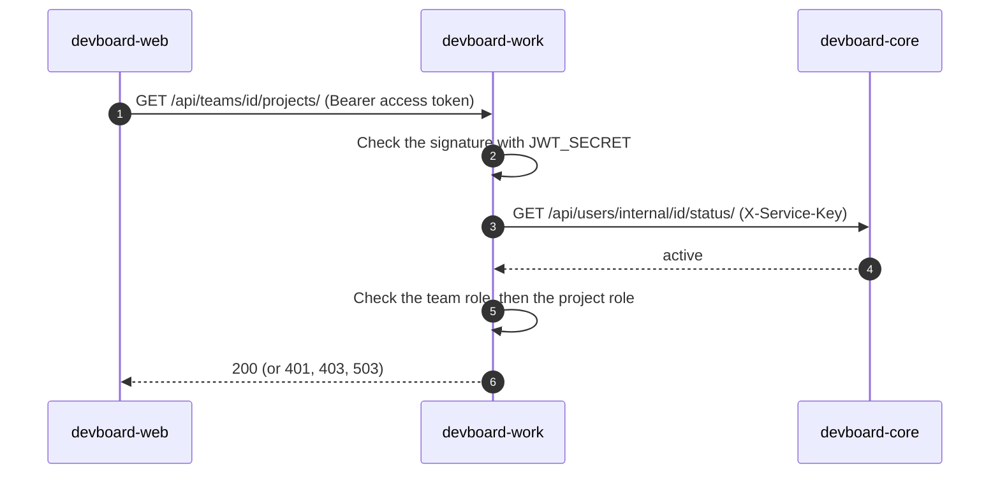

# Auth and security

> **In one minute:** There are two kinds of callers. **Users** prove themselves with a JWT that auth gives them. **Services** prove themselves with one shared key in the header `X-Service-Key`.
> Each service checks the proof itself. No service calls auth to check a token.

## Two kinds of callers

| Caller | Proof | Header | Who checks it |
|---|---|---|---|
| A user (through the web app) | A JWT, signed by auth | `Authorization: Bearer <jwt>` | Every service that has user routes |
| A service | A shared secret, `INTERNAL_API_KEY` | `X-Service-Key: <key>` | Every service that has internal routes |

## 1. User requests

### Where the tokens come from

Auth gives two tokens at login.

| Token | Lives | What it is | Stored |
|---|---|---|---|
| Access token | 5 minutes | JWT, HS256, signed with `JWT_SECRET`. Has the user id (`sub`), email, role and expiry | Not stored by auth |
| Refresh token | 7 days | Random string. Works once, then a new one replaces it | Only its **SHA-256 hash**, in `auth_db` |

The browser never holds these tokens. The web app keeps them in the user's **server-side session** (in Redis) and adds `Authorization: Bearer` to each call. The browser only has a session cookie. The full walk is in [Login and refresh](flows/login-and-refresh.md).

### How a service checks a token

1. Read the `Authorization` header.
2. Verify the signature with `JWT_SECRET`, and only the algorithm `HS256`.
3. Read the user id from `sub`.

Then each service does its own extra checks:

| Service | Extra check after the signature |
|---|---|
| core | Loads the profile from its own database. Blocks users that are not `active`. Sets `last_active`, but only when the stored value is more than 5 minutes old. |
| work | Asks **core** for the user status, cached in Redis for 60 seconds — not a call to core on every request. Then checks the team role and the project role. |
| integrations | None. For team settings it asks work if the user is `owner` or `admin`. |
| analytics | None. For reports it asks work for the project role. |
| attachments | None. The token's `sub` is the owner of the file. |

### Who decides what a user may do

| Level | Roles | Stored in | Checked by |
|---|---|---|---|
| Platform | `admin`, `member` | auth and core (two copies) | core, for its admin routes. It reads **its own** copy |
| Team | `owner`, `admin`, `member`, `viewer` | work | work. integrations asks work |
| Project | `lead`, `contributor` | work | work. analytics asks work |

Being on a team does **not** give access to its projects.

## 2. Service-to-service

A service that calls another one sends `X-Service-Key: <INTERNAL_API_KEY>`. The receiver compares it with its own copy. A wrong key gives `403`.

**All services share the same key.** It is set in every service's `.env`.

### The internal routes

| Receiver | Routes | Called by |
|---|---|---|
| auth | `PATCH /internal/users/<id>/status/`, `PATCH /internal/users/<id>/role/` | core |
| core | `POST /api/users/sync/`, `GET /api/users/search/`, `POST /api/users/lookup/`, `GET /api/users/internal/<id>/status/` | auth, work |
| work | 4 routes under `/api/internal/...`: team member and role, project belongs to team, project member and role, ticket by key | integrations, analytics |
| attachments | `POST /internal/attachments/batch/` | work |
| email | `POST /email/send/` | auth, work (outbox relay) |
| analytics | `POST /events/` | nobody today — kept intentionally for a future manual backfill tool, not dead code |
| integrations | none | – |

### How each receiver compares the key

| Receiver | Compare |
|---|---|
| auth, email, core, work, analytics, attachments | `hmac.compare_digest` (constant time) |

## 3. Other protections

| What | How |
|---|---|
| Passwords | Hashed with bcrypt. Length 8 to 128. |
| Email and reset tokens | Random. Only the hash is stored. They work once. Lifetimes: 1 day and 60 minutes. |
| Guessing attacks | Auth rate limits register, login, resend and forgot-password (counters in Redis). If Redis is down, those routes refuse. |
| Email guessing | `forgot-password` always answers 200. Login gives the same error for a wrong email and a wrong password. |
| GitHub webhook | HMAC-SHA256 signature in `X-Hub-Signature-256`, checked with `hmac.compare_digest`. |
| Slack and Discord URLs | `https` only, and only the hosts `hooks.slack.com`, `discord.com`, `discordapp.com`. This stops a team admin from pointing a webhook at an internal service. |
| File uploads | Temporary links (900 seconds). On confirm, the real content is checked, not the file name. |
| Ownership of files | Before a file is attached, only its owner can use it. Work checks ownership when a comment is created. |

## Secrets

These are **names only**. Values are in each service's `.env` and are never in these docs.

| Name | Used by | What it is for |
|---|---|---|
| `JWT_SECRET` | every service with user routes | Signs and checks access tokens. Same value everywhere |
| `INTERNAL_API_KEY` | every service | The shared service key |
| `GITHUB_WEBHOOK_SECRET` | integrations | Checks GitHub's signature |
| `*_DB_PASSWORD` | infra and each service | The Postgres users |
| `S3_ACCESS_KEY`, `S3_SECRET_KEY` | attachments | MinIO login |
| `SMTP_USER`, `SMTP_PASSWORD` | email | Mail server login |

## If something is down

| Down | What happens to auth |
|---|---|
| **auth** | No new logins, sign-ups or refreshes. Users who are already logged in keep working until their access token ends (up to 5 minutes), because services check the token themselves. |
| **core** | Work keeps working for up to 60 seconds on a cached status check, then stops. Core's own routes stop. |
| **Redis** | Login, sign-up, resend and forgot-password refuse (`503`). The web app cannot read its sessions. |

## ⚠️ Known gaps

- **One shared key.** Any service can call any internal route. One hacked service can call all the others.
- **One shared JWT secret (HS256).** Every service that can check a token can also make one. A hacked service could forge a token for any user.
- **Internal routes are open to anyone who has the key and can reach the port.** App service ports (8001-8008) are still open on the host in dev. Shared infra ports (Postgres, Redis, Mongo, MinIO) are now bound to `127.0.0.1` only. Before going public, block `/internal/...` at a reverse proxy.
- **Some checks are signature only.** integrations, analytics and attachments do not ask if the user is still active. A deactivated user has up to 5 minutes there.
- **A role change is late.** The role is inside the access token, so an old token keeps the old role for up to 5 minutes.
- **IP rate limits may still be shared in production.** Local dev now sets `X-Forwarded-For` correctly (the Vite proxy forwards it, `TRUSTED_PROXY_IPS` trusts the Docker gateway). Production still has no gateway that would set it at all.

Next: [Data map](data-map.md), or open a [flow](flows/README.md).
