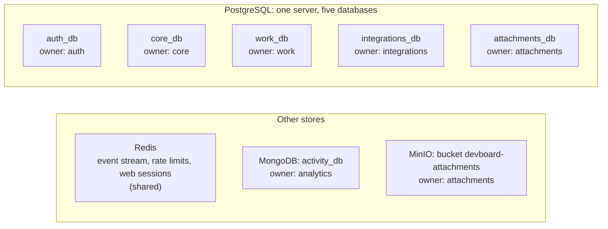

# Data map

> **In one minute:** DevBoard keeps data in 4 kinds of store: PostgreSQL, MongoDB, Redis and MinIO.
> Every database has **one owner**. No service reads another service's tables. Data moves between services by HTTP calls or through the Redis stream.

## The picture

Each box is one database (or one shared store). The owner is the only service that reads and writes it.

`devboard-email` has no store. `devboard-web` has no database of its own. It keeps its login sessions in Redis.

For who calls whom, see [System overview](overview.md).

## PostgreSQL: one server, five databases

One container (`devboard-db`, Postgres 18). Each service has its own database and its own user (`auth_user`, `core_user`, and so on).

| Database | Owner | Tables | What it holds |
|---|---|---|---|
| `auth_db` | auth | `users`, `refresh_tokens`, `verification_tokens`, `password_reset_tokens` | Logins, password hashes, token hashes |
| `core_db` | core | `user_profiles` | Username, avatar, timezone, role, status |
| `work_db` | work | `teams`, `memberships`, `projects`, `project_memberships`, `tickets`, `sprints`, `labels`, `comments`, `outbox_events` | All planning data, and the event outbox |
| `integrations_db` | integrations | `team_integrations`, `repo_links`, `linked_commits`, `notifications`, `failed_events` | Webhook settings, the in-app inbox, commit links |
| `attachments_db` | attachments | `attachments` | File info: owner, name, type, size, status |

**Why Postgres:** this data is relational and needs transactions. Work saves a change and its event in **one transaction** (the outbox). Attachments needs a safe `pending` to `stored` step.

## MongoDB: the activity log

| Database | Owner | Collections | What it holds |
|---|---|---|---|
| `activity_db` | analytics | `events`, `failed_events` | Every event from the stream, in one shape. Events that could not be saved |

**Why MongoDB here:** the details of an event change with its type. A label event and a commit event share only the envelope. The rest of DevBoard is Postgres. This is the one place where a document store fits.

Analytics checks each event's shape when it saves it, so the flexible store does not become unknown data.

## Redis: three jobs

One container (`devboard-redis`, Redis 7), started with `--appendonly yes`. That saves the data to disk, so a restart does not lose the stream or the reader positions.

| Job | Who | Key or name |
|---|---|---|
| **Event stream** | work (through its relay) and integrations write. integrations and analytics read | stream `devboard:events`, groups `devboard-integrations-group` and `devboard-analytics-group` |
| **Rate limits** | auth | `ratelimit:...` counters with an expiry |
| **Web sessions and locks** | web | Django cache sessions (7 days), and `refresh-lock:...` locks |

## MinIO: the files

One container (`devboard-minio`). One bucket, `devboard-attachments` (set by `S3_BUCKET`). Attachments creates it at start if it is missing.

- The **bytes** live in MinIO. The **info** about them lives in `attachments_db`.
- A file's key is `{attachment_id}/{filename}`.
- The browser uploads and downloads straight from MinIO, with temporary links.

## Rules

1. **One owner per database.** Only that service reads and writes it.
2. **No links between databases.** A `user_id` in work is the same UUID as in auth and core. It is copied, and nothing checks it. There are no foreign keys across services.
3. **Data crosses by HTTP or by the stream.** For example, work asks core for a user. Work does not read `core_db`.
4. **Each service keeps only what it needs.** Integrations has no team table. It asks work. Analytics has no user table. It asks work.

## What happens if a store is lost

| Store | If it is lost | Can it come back? |
|---|---|---|
| PostgreSQL | Accounts, profiles, all planning data, notifications | Only from a backup. `stop.bat` writes `backups/devboard_all.sql`. |
| MongoDB | The activity log and the reports | **Yes**, if the stream still exists: a new consumer group replays all events. |
| Redis | The stream, the reader positions, rate limits, web sessions | Sessions and limits start again. Stream events are gone if the disk data is lost. |
| MinIO | All uploaded files | **No.** MinIO is not backed up. |

`reset-db.bat` deletes all four. It backs up Postgres and MongoDB first, and **not** MinIO.

## ⚠️ Known gaps

- **One Postgres for five services.** One point of failure.
- **MinIO has no backup.**
- **Redis does several jobs in one instance.** A reset or a full Redis loses sessions, limits and the stream together.
- **Nothing trims the stream, the outbox or the `failed_events` tables.** They only grow. See [Deletes and cleanup](flows/deletes-and-cleanup.md).
- **Copied ids are not checked.** If a user is removed in one service, nothing removes the copies in the others.

Next: [Auth and security](auth-and-security.md).
