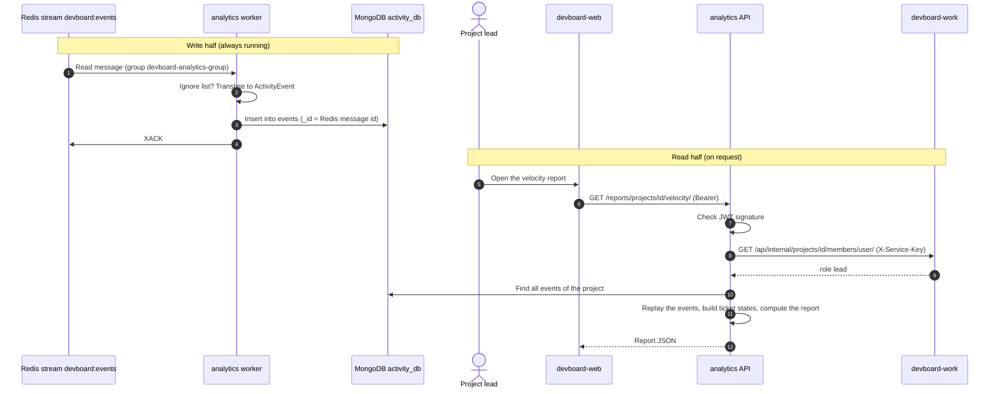

# Flow: analytics pipeline

> **In one minute:** Analytics has two halves. The **write half** reads events from the Redis stream and saves them in MongoDB.
> The **read half** answers report requests by replaying those saved events. The two halves run in two containers.

## The picture

## The write half

1. **Read.** The worker (`python -m app.consumer.worker`) reads the stream as group `devboard-analytics-group`. First it takes back messages that were idle for 30 seconds. Then it reads new ones (up to 10, wait up to 5 seconds).
2. **Ignore list.** `comment.mentioned` is acked and skipped. It is a notification, not activity.
3. **Too many tries.** If a message was delivered more than 3 times, it goes to `failed_events` with its raw data, and is acked.
4. **Translate.** `translate_event` turns the published event into one `ActivityEvent`. The saved name is not always the published name. For example, `ticket.status_changed` becomes `ticket.updated` with `metadata.field = "status"`. That way all field changes have one shape.
5. **Check.** Each action must have its own metadata shape. A bad event, or an **unknown** event, goes to `failed_events` and is acked. New event types must be added on purpose.
6. **Set id and time.** `_id` is the Redis message id. `created_at` is the time **inside** the message id, not "now".
7. **Insert and ack.** A duplicate `_id` is ignored.

Why it is safe to restart or replay:

- Same message twice: the second insert is ignored (same `_id`).
- A new consumer group reads the whole stream from the start. If you drop the MongoDB data, the log comes back from Redis.
- Times stay true, because they come from the message id.

## The read half

| Report | Who | What you get |
|---|---|---|
| `GET /reports/projects/{id}/activity/` | Project members | Activity feed. Contributors see only their own actions. Leads see all, and can filter with `actor=<user_id>`. |
| `GET /reports/projects/{id}/activity/summary/` | Project members | Who did what. Same visibility rule. |
| `GET /reports/projects/{id}/velocity/` | Project **leads** | Story points planned and finished per sprint, plus the average. |
| `GET /reports/projects/{id}/cycle-time/` | Project **leads** | Median **lead time** (created to done) and **cycle time** (time really worked on). |
| `GET /reports/sprints/{id}/burndown/` | Project **leads** | Work left per day, next to the ideal line. Needs the sprint's start and end dates, or `409`. |

**How a report is built.**

1. The API checks the JWT signature. It does not ask core if the user is active.
2. It asks **work** for the caller's project role. Analytics has no user or membership data. For burndown it first finds the sprint's project in its own log.
3. It loads the project's events from MongoDB.
4. It **replays** them in memory (`build_ticket_states`) to rebuild each ticket: its points, status and sprint over time.
5. It computes the report from those states and returns it. **Nothing is cached.**

## Try it with fake data

The stack must be running. From the `devboard-analytics` folder:

1. `.venv\Scripts\python.exe scripts\bootstrap_demo.py` creates users, a team and a project.
2. `.venv\Scripts\python.exe scripts\seed_events.py --wipe` adds a two-sprint story to MongoDB. `--wipe` deletes existing events. Set `MONGO_URI` first.

## If a step fails

| Step | What happens |
|---|---|
| Worker stopped | Events wait in the stream. They are saved when it starts again. |
| MongoDB is down | The worker fails and the messages stay pending. If a message passes 3 deliveries before MongoDB is back, it goes to `failed_events` instead of `events`. The raw data is kept. |
| Redis is down | The log stops growing. Reports still work. |
| Read half, work is down | Every report route returns `503`. |
| Read half, not a member | `403` |
| Sprint has no dates (burndown) | `409` |

## ⚠️ Known gaps

- **Every report replays the whole project log.** Nothing is cached. Big projects will be slower.
- **Duplicate events from work are not caught.** A resent outbox row gets a new Redis id, so it is stored twice. See [Events and notifications](events-and-notifications.md).
- **One worker only.** The consumer name is fixed (`devboard-analytics-1`).
- **Events lost to a long MongoDB outage end up in `failed_events`**, and nothing replays them.
- **Some events are never logged.** Creating a team, a project or a member sends no event, so it is not in the log.

## Key code

| Where | What is there |
|---|---|
| [analytics `app/consumer/worker.py`](https://github.com/devboard-app/devboard-analytics/blob/637ba5e/app/consumer/worker.py) | The write loop |
| [analytics `app/consumer/translation.py`](https://github.com/devboard-app/devboard-analytics/blob/637ba5e/app/consumer/translation.py) | `translate_event`, `created_at_from_message_id` |
| [analytics `app/repositories/events.py`](https://github.com/devboard-app/devboard-analytics/blob/637ba5e/app/repositories/events.py) | `insert_event` |
| [analytics `app/services/reports.py`](https://github.com/devboard-app/devboard-analytics/blob/637ba5e/app/services/reports.py) | `build_ticket_states`, `get_velocity`, `get_burndown`, `get_cycle_time` |
| [analytics `app/routers/reports.py`](https://github.com/devboard-app/devboard-analytics/blob/637ba5e/app/routers/reports.py) | The routes and who may call each |
| [analytics `app/dependencies.py`](https://github.com/devboard-app/devboard-analytics/blob/637ba5e/app/dependencies.py) | `get_project_role`, `require_project_lead` |

Next: [Deletes and cleanup](deletes-and-cleanup.md).
