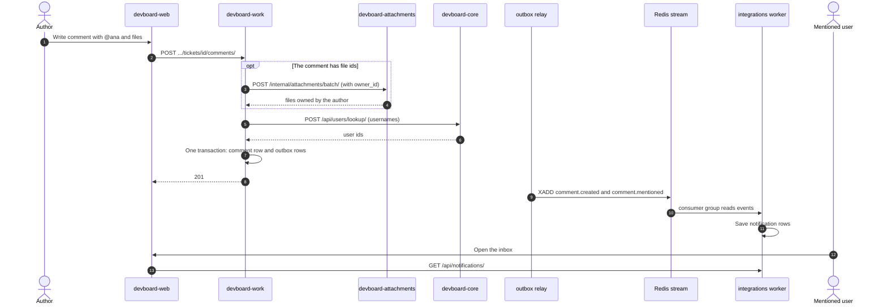

# Flow: comment and @mention

> **In one minute:** A user writes a comment on a ticket and mentions a teammate with `@username`.
> Work saves the comment and sends events. A few seconds later, the mentioned person and the ticket's assignee see a notification in their in-app inbox.

## The picture

## Step by step

1. **The author sends the comment.** `POST .../tickets/<ticket_id>/comments/` with the text and, optionally, file ids. Work first runs the checks from [Team, project and ticket](team-project-ticket.md).
2. **Work checks the files.** If there are file ids, work asks attachments: "are these stored, and do they belong to this user?" (`owner_id`). If any id fails, the answer is `400` "Unknown attachment, or it does not belong to you." If attachments is down, `503`. See [File upload](file-upload.md).
3. **Work finds the mentions.** It reads every `@username` in the text and asks core to turn the names into user ids (`POST /api/users/lookup/`). These are dropped **without an error**:
   - names that do not exist,
   - the author mentioning themselves,
   - users who are not members of the project.
4. **Work decides who gets notified.**
   - Every mentioned user gets a `comment.mentioned` event.
   - The ticket's assignee gets a `comment.created` event with a `recipient_id`. But **not** if the assignee is the author, and **not** if they are already mentioned. They get one notification, not two.
5. **Work saves everything in one transaction:** the comment, and one outbox row per event.
6. **The relay sends the events** to the Redis stream `devboard:events` (about every 2 seconds).
7. **The integrations worker reads them** and saves one row per recipient in `notifications`: type `mention` ("You were mentioned in a comment on ticket DEV-12.") or type `comment` ("New comment on ticket DEV-12."). Each has a link to the ticket.
8. **The user opens the inbox.** `GET /api/notifications/` returns their notifications. `limit` defaults to 20 and is at most 100. They can mark one or all as read, or delete one.

Analytics also reads `comment.created` and stores it in the activity log. It **ignores** `comment.mentioned`, because that is a notification and not activity.

## Edit and delete

- **Edit.** Only the author. Work rebuilds the mention list from the new text. Only **new** mentions get a notification. Work sends `comment.updated`. Files cannot be changed by an edit.
- **Delete.** The author, or any project lead. Work sends `comment.deleted`.

## If a step fails

| Step | What happens |
|---|---|
| 2, attachments is down | `503`. The comment is not saved. |
| 3, core is down | The comment **is saved**. The mentions are skipped, and the mentioned people are **not** notified. There is no error and no later retry. |
| 6, Redis is down | The comment is saved. The events wait in the outbox. |
| 7, the worker fails on an event | The message stays pending and is retried. After 3 tries it goes to `failed_events`. See [Events and notifications](events-and-notifications.md). |
| Reading a comment, attachments is down | The comment loads with an empty `attachments` list. |

## ⚠️ Known gaps

- **A core outage silently drops mentions.** The comment looks fine to the author.
- **Assignee notifications are not filtered for everyone.** For comments, work skips the author and the already-mentioned. For assignment and status changes it does not skip the actor. See [Team, project and ticket](team-project-ticket.md).

## Key code

| Where | What is there |
|---|---|
| [work `comments/services.py`](https://github.com/devboard-app/devboard-work/blob/0beba51/comments/services.py) | `create_comment`, `update_comment`, `delete_comment`, `_resolve_mentions` |
| [work `comments/infrastructure.py`](https://github.com/devboard-app/devboard-work/blob/0beba51/comments/infrastructure.py) | `verify_attachments`, `resolve_attachments`, `resolve_usernames` |
| [integrations `app/consumer/handlers.py`](https://github.com/devboard-app/devboard-integrations/blob/694a98f/app/consumer/handlers.py) | `handle_comment_created`, `handle_mention` |
| [integrations `app/notifications/services.py`](https://github.com/devboard-app/devboard-integrations/blob/694a98f/app/notifications/services.py) | `create_notification` |

Next: [File upload](file-upload.md).
