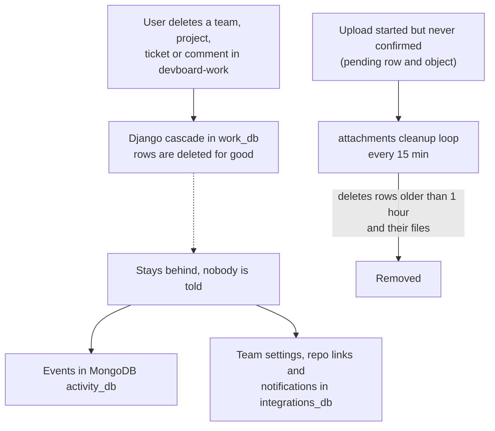

# Flow: deletes and cleanup

> **In one minute:** DevBoard has **no soft delete**, and cross-service cleanup is the exception, not the rule. Work deletes rows for good, and mostly tells nobody.
> Two things clean up after themselves: the attachments cleanup loop (abandoned uploads), and comment deletes now reaching attachments directly. Everything else stays until someone removes it by hand.

This page is mostly about what does **not** happen. That is on purpose: it is the messy part.

## The picture

## What gets deleted, and how

| What | Who deletes | How |
|---|---|---|
| Team | Work | `DELETE /api/teams/<id>/`. Django **cascades** to memberships, projects, and everything below. |
| Project | Work | Cascades to project members, tickets, comments, labels and sprints. |
| Ticket | Work | Cascades to its comments. Sends `ticket.deleted`. |
| Comment | Work | Author, or any project lead. Sends `comment.deleted` **with the comment's attachment ids** — attachments deletes those files and rows in response. This is the one delete that does clean up after itself across services. |
| Sprint | Work | Only a sprint that has not started. Tickets in it stay, without a sprint. |
| Notification | The user | `DELETE /api/notifications/<id>/`. |
| Attachment | The owner | `DELETE /attachments/<id>/`. Removes the row and the file. |
| User | **Nobody** | There is no delete-user route. An admin can only set the user to `inactive`. |

All deletes in work are **hard deletes**. No model has a "deleted" flag.

## The cleanups that do exist

| Cleanup | Where | What it does |
|---|---|---|
| **Pending uploads** | attachments, loop every 15 minutes | Deletes `pending` rows older than **1 hour**, and their files. The only scheduled cleanup job. |
| **Failed confirm** | attachments | If the file is missing, too big or the wrong type, the row and the file are removed at once. |
| **Deleted comment's attachments** | attachments, event-driven | On `comment.deleted`, deletes the files and rows for the ids in the event. Not a scheduled job — reacts to the event as it arrives. |
| **Half-made team or project** | work | If the owner or lead membership cannot be saved, work deletes the new team or project again. |
| **Deactivation** | auth | Revokes all refresh tokens of the user. |

Revoked tokens are marked, not deleted.

## What is left behind

| What stays | Why |
|---|---|
| **Events of deleted projects and tickets** | Analytics keeps its log. A cascade deletes tickets **without** sending `ticket.deleted` for each one. Nobody can read the reports of a deleted project, because the role check in work fails. |
| **Team settings, repo links and notifications** of a deleted team | Integrations has its own database and no link to work's rows. Nothing tells it. |
| **Delivered outbox rows** | The relay marks them delivered and never deletes them. |
| **Outbox rows that failed after 150 attempts** | Retries now back off with a growing delay (up to 150 attempts, roughly half a day) instead of giving up after 5 tries in ~10 seconds — but a row that still exhausts every attempt stays unsent, and nothing retries it further. |
| **The event stream** | `XADD` has no size limit. The stream is never trimmed. |
| **`failed_events`** in integrations and analytics | Nothing reads them and nothing empties them. In analytics, the worker now pauses instead of processing while MongoDB is down, so fewer healthy events end up here — but a message that fails 3 genuine attempts still lands here. |
| **Revoked and expired tokens** in auth | Only marked. There is no purge job. |

## Why it looks like this

Each service owns its own database. That is the rule: no service reads or writes another one's tables. So there are no foreign keys across services, and a delete in work cannot cascade into attachments or integrations by itself. Someone has to send a message. Today nobody does.

The events already exist as the way to tell other services. Work sends `ticket.deleted` and `comment.deleted`. `comment.deleted` now carries its attachment ids, and attachments reacts to it — but nothing else reacts to `ticket.deleted`, and cascaded deletes (a project taking its tickets with it) send no per-item events at all.

## ⚠️ Known gaps

- **Cascades are silent.** Deleting a project sends no per-ticket events.
- **Growing tables and streams.** The outbox, the event stream and the failure tables only grow.
- **No way to delete a user.** The PRD lists it, but no route exists.

## Ideas, not built

These are not in the code. They are listed only as directions:

- Add a job that deletes old delivered outbox rows.
- Trim the stream, for example with a maximum length.

## Key code

| Where | What is there |
|---|---|
| [attachments `app/cleanup.py`](https://github.com/devboard-app/devboard-attachments/blob/0921514/app/cleanup.py) | `cleanup_pending` |
| [attachments `docker-compose.yml`](https://github.com/devboard-app/devboard-attachments/blob/0921514/docker-compose.yml) | The loop: `while true; do python -m app.cleanup; sleep 900; done` |
| [auth `app/services/auth.py`](https://github.com/devboard-app/devboard-auth/blob/b53e136/app/services/auth.py) | `verify_email` (calls core before committing, no rollback needed), `update_user_status` |
| [work `projects/services.py`](https://github.com/devboard-app/devboard-work/blob/0beba51/projects/services.py) | `create_project_with_lead` (the rollback), `delete_project` |
| [work `teams/services.py`](https://github.com/devboard-app/devboard-work/blob/0beba51/teams/services.py) | `create_team_with_owner` (the rollback) |
| [work `comments/services.py`](https://github.com/devboard-app/devboard-work/blob/0beba51/comments/services.py) | `delete_comment` (sends attachment ids with the event) |
| [attachments `app/consumer/worker.py`](https://github.com/devboard-app/devboard-attachments/blob/0921514/app/consumer/worker.py) | Reacts to `comment.deleted`, deletes the files |

Next: go back to the [flow index](README.md), or open a [service page](../../README.md#pages).
