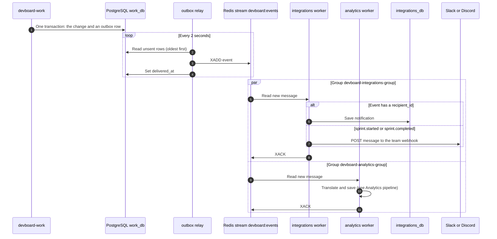

# Flow: events and notifications

> **In one minute:** When something changes in `devboard-work`, work writes an **event** next to the change.
> A relay sends the event to a Redis stream. Two readers take it from there: integrations (notifications, Slack, Discord) and analytics (the activity log).

## The picture

## Step by step

1. **A change and its event are saved together.** Work uses `write_with_outbox`. One database transaction saves the change and a row in `outbox_events`. If the transaction fails, neither exists.
2. **The relay reads the outbox.** The container `devboard-work-outbox-relay` runs `python manage.py drain_outbox`. Every 2 seconds it reads up to 100 unsent rows, oldest first. Redis rows go before email rows.
3. **The relay sends each row** with `XADD` to the stream `devboard:events`. Every value in the event is a string. On success it sets `delivered_at`.
4. **Two consumer groups read the same stream.** Each group has its own position, so each sees **every** message.

**What integrations does with an event:**

| Event | Result |
|---|---|
| `ticket.assigned`, `ticket.status_changed`, `comment.created`, `comment.mentioned` | A row in `notifications` for the `recipient_id`. The status-change and comment events are skipped when there is no `recipient_id`. |
| `sprint.started`, `sprint.completed` | A message to the team's Slack and Discord webhooks. Sent **only if** the URL is set **and** that trigger is `true` in `enabled_triggers`. |
| Any other event | Acked and dropped, on purpose. |

**What analytics does:** see [Analytics pipeline](analytics-pipeline.md).

**How a reader handles a failure** (integrations and analytics work the same way):

1. If a handler raises, the message is **not** acked. It stays *pending*.
2. Every loop, the reader takes back messages that were idle too long (60 seconds in integrations, 30 in analytics).
3. After **3 deliveries** the message goes to the `failed_events` table or collection, with the raw data, and is acked.

**Events that exist today:**

- Tickets (work): `ticket.created`, `ticket.updated`, `ticket.assigned`, `ticket.unassigned`, `ticket.status_changed`, `ticket.deleted`
- Ticket links (work): `ticket.epic_linked`, `ticket.epic_unlinked`, `ticket.sprint_added`, `ticket.sprint_removed`
- Labels (work): `label.applied`, `label.removed`
- Sprints (work): `sprint.started`, `sprint.completed`
- Comments (work): `comment.created`, `comment.updated`, `comment.deleted`, `comment.mentioned`
- Commits (integrations): `ticket.commit_linked`. See [GitHub webhook](inbound-webhook.md).

## Why an outbox

The request must not fail just because Redis is slow, and the event must not be lost if work stops right after saving. Writing the event into the same database transaction makes both true. The relay does the risky part later.

## If a step fails

| Step | What happens |
|---|---|
| 3, Redis is down | The row stays unsent. The relay tries again on the next poll. |
| 3, sending fails 5 times | The row is skipped for good. See the gap below. |
| Reader is stopped | Events wait in the stream. The reader catches up when it starts again. |
| Redis restarts | The stream and the group positions survive, because Redis runs with `--appendonly yes`. |
| Slack or Discord fails | Logged. **Not retried.** The message is lost. |
| Handler bug on one event | Retried 3 times, then saved in `failed_events`. Other events keep flowing. |

## ⚠️ Known gaps

- **The outbox gives up fast.** 5 attempts, 2 seconds apart. A Redis outage longer than about 10 seconds strands those rows. Nothing retries them.
- **An event can be sent twice.** If the relay sends a row and fails to mark it delivered, it sends it again with a new Redis id. Analytics dedupes by Redis id, so it cannot catch this.
- **The stream is never trimmed.** `XADD` has no size limit. The stream grows for ever. (It also means a new group can replay the full history.)
- **Delivered outbox rows are never deleted.** The table grows.
- **One reader per group.** The consumer names are fixed. Two workers would break retry counting.
- **A wrong event name is silent.** Integrations drops events it has no handler for. A typo in a handler key gives no error.

## Key code

| Where | What is there |
|---|---|
| [work `outbox/writer.py`](https://github.com/devboard-app/devboard-work/blob/0beba51/outbox/writer.py) | `write_with_outbox` |
| [work `outbox/management/commands/drain_outbox.py`](https://github.com/devboard-app/devboard-work/blob/0beba51/outbox/management/commands/drain_outbox.py) | The relay loop |
| [work `outbox/dispatch.py`](https://github.com/devboard-app/devboard-work/blob/0beba51/outbox/dispatch.py) | `dispatch` (`XADD` or HTTP to email) |
| [work `work/infrastructure/events.py`](https://github.com/devboard-app/devboard-work/blob/0beba51/work/infrastructure/events.py) | `build_payload` |
| [integrations `app/consumer/worker.py`](https://github.com/devboard-app/devboard-integrations/blob/694a98f/app/consumer/worker.py) | The read loop and retry count |
| [integrations `app/consumer/handlers.py`](https://github.com/devboard-app/devboard-integrations/blob/694a98f/app/consumer/handlers.py) | `HANDLERS` |
| [analytics `app/consumer/worker.py`](https://github.com/devboard-app/devboard-analytics/blob/637ba5e/app/consumer/worker.py) | The other reader |

Next: [GitHub webhook](inbound-webhook.md).
