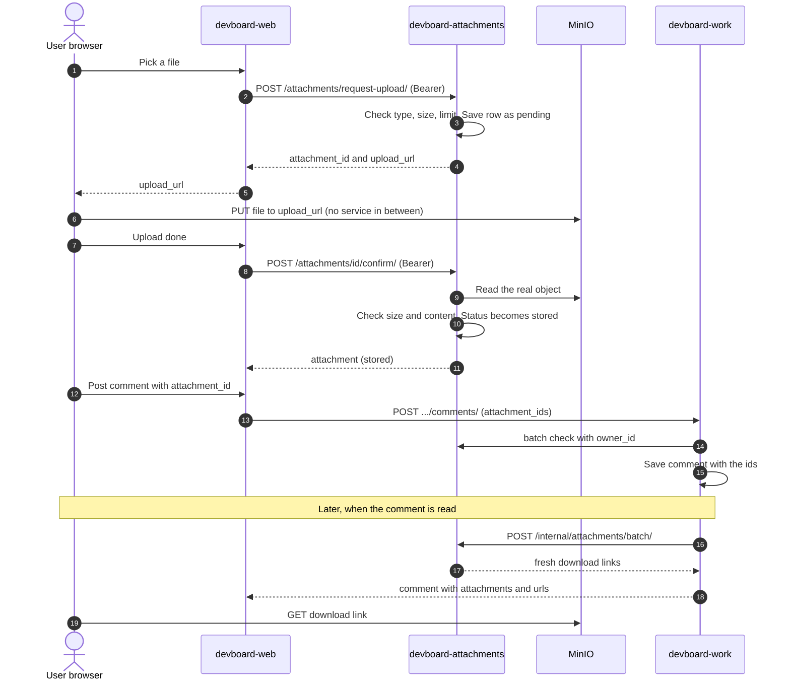

# Flow: file upload

> **In one minute:** The file goes **straight from the browser to MinIO**. It never passes through a service.
> Attachments hands out a temporary upload link, then checks that the uploaded file is real. Then the file id goes into a comment.

## The picture

## Step by step

**1. Ask for an upload**

1. The browser calls the web app. The web app calls `POST /attachments/request-upload/` with the user's token.
2. Attachments checks the **claims**:
   - The content type is on the allow list: `image/png`, `image/jpeg`, `image/webp`, `image/gif`, `application/pdf`, `text/plain`.
   - The declared size is under `MAX_FILE_SIZE_MB` (5 by default).
   - The context has fewer than `MAX_ATTACHMENTS_PER_CONTEXT` files (5 by default).
3. It saves a row with status `pending` and the storage key `{id}/{filename}`, and signs a temporary **PUT** link. The link is signed for the **public** MinIO address, because the browser must be able to reach it.

**2. Upload**

4. The browser sends `PUT` to that link. **MinIO receives the bytes.** Attachments and the web app are not involved.

**3. Confirm**

5. The browser tells the web app it is done. The web app calls `POST /attachments/<id>/confirm/`.
6. Attachments **does not trust step 2**. It reads the real object from MinIO and checks:

| Check | If it fails |
|---|---|
| The object exists | `409`, row removed |
| The real size is the declared size | `409`, row removed |
| The real size is under the max | `413`, row and file removed |
| The content matches the type | `415`, row and file removed |

The content check looks inside the file: images must open in Pillow, PDFs must start with `%PDF-`, text must decode as UTF-8. A zip file named `cat.png` fails.

7. On success the row becomes `stored`. The real size is saved. Calling confirm again is safe.

**4. Attach to a comment**

8. The user posts a comment with the file ids. Work asks attachments to check that every id is `stored` **and owned by the author**. Then work saves the ids on the comment. Work does not copy the file.

**5. Read it later**

9. When a comment is read, work sends the ids to `POST /internal/attachments/batch/`. It sends up to 100 at once, so a whole page of comments needs one call. Attachments returns a **fresh download link** for each `stored` file. Links last 900 seconds by default. They are made when needed and never saved.
10. The browser downloads the file straight from MinIO with that link.

## If a step fails

| Step | What happens |
|---|---|
| 1, type or size not allowed | `4xx` before anything is saved |
| 2, MinIO is down | The upload fails. The `pending` row is left. Cleanup removes it later. |
| The user closes the page after step 1 | Same: a `pending` row is left. |
| 3, wrong content | Row and file are removed. Nothing is left half done. |
| 8, attachments is down | The comment is **not** saved (`503`). |
| 9, attachments is down | The comment loads with an empty `attachments` list. |

**Cleanup.** A loop in the container `devboard-attachments-cleanup` runs every 15 minutes. It deletes `pending` rows **older than 1 hour**, and their files. See [Deletes and cleanup](deletes-and-cleanup.md).

## ⚠️ Known gaps

- **The per-context limit can be skipped.** It counts only `stored` files. Many uploads requested before any confirm all pass.
- **Files of deleted comments stay in MinIO.** Nothing deletes a `stored` file when its comment is deleted. The `comment.deleted` event has no file ids.
- **Read links are not owner-checked.** Work sends `owner_id` when it creates a comment, but not when it reads. The ownership check happens once, at create.
- **Dev setup only.** In development the public address is `localhost:9000`. In production the two addresses may become one.

## Key code

| Where | What is there |
|---|---|
| [attachments `app/services/attachments.py`](https://github.com/devboard-app/devboard-attachments/blob/0921514/app/services/attachments.py) | `request_upload`, `confirm_upload`, `resolve_batch` |
| [attachments `app/storage.py`](https://github.com/devboard-app/devboard-attachments/blob/0921514/app/storage.py) | `presign_put`, `presign_get`, `stat_object`, `download_object` |
| [attachments `app/cleanup.py`](https://github.com/devboard-app/devboard-attachments/blob/0921514/app/cleanup.py) | `cleanup_pending` |
| [work `comments/infrastructure.py`](https://github.com/devboard-app/devboard-work/blob/0beba51/comments/infrastructure.py) | `verify_attachments`, `resolve_attachments` |

Next: [Events and notifications](events-and-notifications.md).
