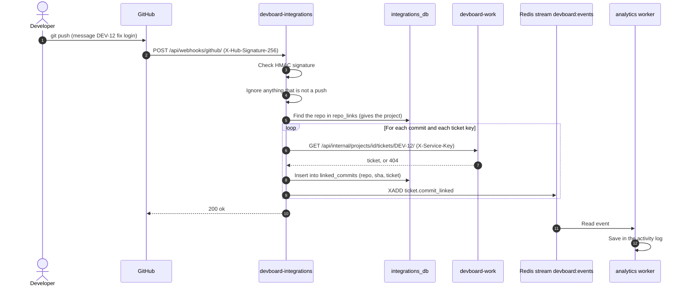

# Flow: GitHub webhook

> **In one minute:** A developer pushes a commit with a ticket key in the message, like `DEV-12 fix login`.
> GitHub calls integrations. Integrations checks the signature, finds the ticket in work and puts a `ticket.commit_linked` event on the stream.

## The picture

## Before it works: the setup

A team admin does this once, in the web app:

1. Save the team's integration settings (`/api/integrations/<team_id>/`).
2. Link the GitHub repo to a project: `POST /api/integrations/<team_id>/repo-links/` with `project_id` and `github_repo` (like `owner/name`). Both calls need a JWT **and** the `owner` or `admin` role on the team. Integrations asks work to check the role.
3. In GitHub, add a webhook that points to `/api/webhooks/github/` with the same secret as `GITHUB_WEBHOOK_SECRET`.

## Step by step

1. **GitHub sends the push.** `POST /api/webhooks/github/`. There is no JWT here. GitHub proves itself with the `X-Hub-Signature-256` header.
2. **Integrations checks the signature.** It computes an HMAC-SHA256 of the raw body with `GITHUB_WEBHOOK_SECRET` and compares it with `hmac.compare_digest`. A bad or missing signature gives `403`.
3. **Only pushes count.** Any other GitHub event gets `200 {"status": "ignored"}`.
4. **Find the project.** The repo name must be in `repo_links`. An unknown repo is ignored. The link tells integrations which **project** to look in. That way `DEV-12` only matches inside that project.
5. **Find ticket keys.** For each commit, the pattern `\b([A-Z][A-Z0-9]{1,9}-\d+)\b` finds keys. It is not case sensitive. Keys are made upper case.
6. **Ask work.** `GET /api/internal/projects/<project_id>/tickets/<key>/` with `X-Service-Key`. `404` means "no such ticket": skip it.
7. **Record the link.** Integrations inserts `(repo, commit_sha, ticket_id)` in `linked_commits`. It has a **unique key**. GitHub sometimes sends the same webhook twice. The second one hits the key and is skipped.
8. **Publish the event.** `XADD` to `devboard:events` with the ticket, the commit SHA, URL and message, and the repo. The actor is a **fixed system id** (all zeros), not the commit author, because anyone can fake `git commit --author`. **If this fails, the `linked_commits` row from step 7 is deleted again**, so a GitHub redelivery finds no row and retries the link fresh instead of being skipped as a false duplicate.
9. **Answer GitHub.** `200 {"status": "ok"}` if every commit linked successfully. If any commit's publish failed, `502` instead — GitHub redelivers on a non-2xx response.

Analytics reads `ticket.commit_linked` and stores it. Integrations' own worker has no handler for it, so it drops it.

## If a step fails

| Step | What happens |
|---|---|
| 2, wrong signature | `403`. Logged with the GitHub delivery id. |
| 4, unknown repo | Ignored. `200`. |
| 6, work is down | The lookup returns "not found". That commit is **skipped**. |
| 8, Redis is down | The `linked_commits` row is undone and the webhook answers `502`, so GitHub redelivers the push. |
| Any error while linking one commit | Logged. The other commits still run. The webhook answers `502` if any commit failed, so GitHub retries the whole push — already-linked commits are skipped again via the unique key, so this is safe to redeliver. |

## ⚠️ Known gaps

- **The event is not sent through an outbox.** Unlike work, integrations writes straight to Redis — the undo-and-502 approach leans on GitHub's own redelivery instead of building a local retry queue.
- **One repo, one project.** `repo_links.github_repo` is unique across all teams.

## Key code

| Where | What is there |
|---|---|
| [integrations `app/webhooks/views.py`](https://github.com/devboard-app/devboard-integrations/blob/694a98f/app/webhooks/views.py) | The route and `_verify_signature` |
| [integrations `app/webhooks/services.py`](https://github.com/devboard-app/devboard-integrations/blob/694a98f/app/webhooks/services.py) | `handle_github_push`, `extract_ticket_keys`, `lookup_ticket`, `publish_commit_linked` |
| [integrations `app/integrations/repository.py`](https://github.com/devboard-app/devboard-integrations/blob/694a98f/app/integrations/repository.py) | `record_linked_commit`, `get_repo_link_by_github_repo` |
| [work `work/urls.py`](https://github.com/devboard-app/devboard-work/blob/0beba51/work/urls.py) | The internal ticket-by-key route |

Next: [Analytics pipeline](analytics-pipeline.md).
