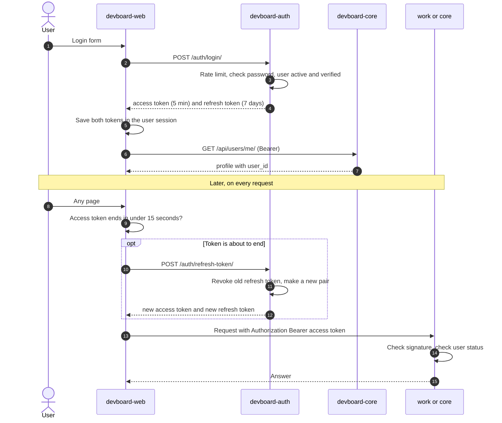

# Flow: login and refresh

> **In one minute:** Auth gives the user two tokens: an **access token** (5 minutes) and a **refresh token** (7 days).
> The web app keeps both in a server-side session. It sends the access token to every service and swaps the refresh token for a new pair before the access token runs out.

## The picture

## Step by step

**Login**

1. The user sends email and password. The web app calls `POST /auth/login/`.
2. Auth checks the rate limit: 5 per 15 minutes per IP **and** per email.
3. Auth checks the password. The user must be **active** and **verified**, otherwise `403`.
4. Auth saves the **hash** of a new random refresh token, then answers with both tokens. The access token is a JWT (HS256) with the user id (`sub`), email, role and expiry.
5. A good login clears the login counters.
6. The web app saves both tokens in the user's **session** (a Django session in the cache, cookie valid 7 days). The browser only holds the session cookie. Then the web app calls core `GET /api/users/me/` to learn the user id.

**Every later request**

7. Before each call, the web app checks the expiry. If the access token ends in less than 15 seconds, it refreshes first.
8. It adds `Authorization: Bearer <access token>` and calls the service.
9. The service checks the signature with the shared `JWT_SECRET`. No call to auth is needed. The extra checks depend on the service:

| Service | Extra check |
|---|---|
| core | Loads the profile from its database. Blocks inactive users. Sets `last_active`, but only when the stored value is more than 5 minutes old. |
| work | Asks core for the user status, cached in Redis for 60 seconds so it isn't a call to core on every request. Then checks team role and project role. |
| integrations, analytics, attachments | Signature only. |

**Refresh**

10. Auth looks up the hash of the refresh token. It must exist, not be revoked, not be expired, and the user must still be active.
11. Auth revokes the old refresh token and issues a new pair. **Each refresh token works once.**
12. The web app takes a **Redis lock** while it refreshes. Two parallel requests would otherwise use the same old token, and the second one would fail. If a service answers `401`, the web app refreshes once and retries the call once.

**Logout.** `POST /auth/logout/` revokes one refresh token. `POST /auth/logout-all/` revokes all tokens of that user.

## Forgot password

1. The user asks for a reset. The web app calls `POST /auth/forgot-password/`. Limit: 3 per hour per IP, 10 per hour per email.
2. Auth **always answers 200**, so nobody can test which emails exist. If the user exists, auth saves a reset token hash and asks email to send the link (`template password_reset`).
3. The user opens the link. The web app calls `POST /auth/reset-password/` with the token and the new password.
4. The token must exist, be unused and be under 60 minutes old. Auth saves the new password, marks the token used and **revokes all refresh tokens**.

## When an admin deactivates a user

1. An admin calls core `PATCH /api/users/<id>/status/`.
2. Core calls auth `PATCH /internal/users/<id>/status/`. If auth is down, the change fails with `502` and nothing is saved.
3. Auth marks the user inactive and **revokes all refresh tokens**.
4. Core saves the new status.

What the user can still do afterwards:

| Where | Result |
|---|---|
| core | Blocked at once — checks its own database on every request. |
| work | Blocked within 60 seconds — the status check is cached that long. |
| Refresh | Blocked at once. |
| integrations, analytics, attachments | Still allowed until the access token expires, **at most 5 minutes**. |

## If a step fails

| Step | What happens |
|---|---|
| Login, Redis is down | `503` |
| Login, wrong password or unknown email | `401` "Invalid credentials" (the same answer for both) |
| Login, user not verified or inactive | `403` |
| Refresh, token used twice or revoked | `401`. The user must log in again. |
| Any work request, core is down | `503`. Work cannot check the user status. |

## ⚠️ Known gaps

- **A role change is not seen at once.** The role is inside the access token, so an issued token keeps the old role for up to 5 minutes.
- **Some services check only the signature**, so a deactivated user has up to 5 minutes there.
- **IP rate limits may still be shared in production.** See the gap in [Sign-up](sign-up-and-verify.md) — local dev is fixed, production has no gateway yet to set `X-Forwarded-For`. Login is limited per IP and per email; if auth sees one IP for everyone, 5 failed logins from any user can lock everyone out for 15 minutes.

## Key code

| Where | What is there |
|---|---|
| [auth `app/services/auth.py`](https://github.com/devboard-app/devboard-auth/blob/b53e136/app/services/auth.py) | `login`, `refresh`, `logout`, `logout_all`, `forgot_password`, `reset_password`, `update_user_status` |
| [auth `app/services/jwt.py`](https://github.com/devboard-app/devboard-auth/blob/b53e136/app/services/jwt.py) | `create_access_token`, `generate_refresh_token`, `validate_refresh_token` |
| [core `users/authentication.py`](https://github.com/devboard-app/devboard-core/blob/cb0c3e6/users/authentication.py) | `JWTAuthentication` |
| [work `work/authentication.py`](https://github.com/devboard-app/devboard-work/blob/0beba51/work/authentication.py) | `JWTAuthentication` (asks core for the status) |
| [core `users/services.py`](https://github.com/devboard-app/devboard-core/blob/cb0c3e6/users/services.py) | `update_user_status` (calls auth first) |

Next: [Team, project and ticket](team-project-ticket.md).
