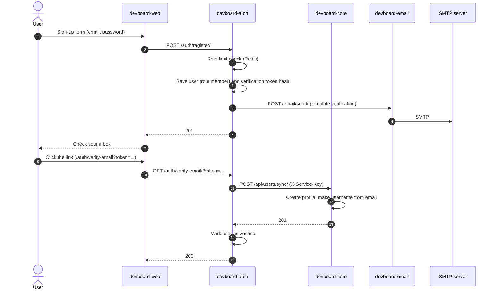

# Flow: sign-up and email check

> **In one minute:** A new user fills in the sign-up form. Auth saves the user and email sends a "verify your email" mail.
> Core does not create the profile until the user actually clicks that link. The user cannot log in until they do.

## The picture

## Step by step

1. **The user sends the form.** The web app calls `POST /auth/register/` on auth. The password must be 8 to 128 characters.
2. **Auth checks the rate limit.** Register allows 10 per hour per IP. The counter lives in Redis.
3. **Auth saves the user.** The role is `member`. The verification token is random. Only its hash is saved. Auth commits to the database. Core is not involved yet.
4. **Auth calls email.** `POST /email/send/` with the template `verification` and the link. The link points to the web app: `FRONTEND_URL/auth/verify-email?token=...`.
5. **Email sends the mail** over SMTP with STARTTLS.
6. **The user clicks the link.** The web app calls `GET /auth/verify-email/?token=...` on auth. Auth checks that the token exists, is not used and is not older than 1 day.
7. **Auth calls core**, `POST /api/users/sync/` with `X-Service-Key`, **before** marking the user verified. Core creates the profile with the same user id and makes the **username** from the email: the part before `@`, cleaned. If it is taken, core adds a number (`ana`, `ana2`). Core's sync is safe to call more than once with the same user.
8. Only after core answers does auth mark the user as verified and the token as used, then commits.

After step 8 the user can [log in](login-and-refresh.md). Login is refused with `403` until the user is verified.

## If a step fails

| Step | What happens |
|---|---|
| 2, too many requests | `429` |
| 2, Redis is down | `503`. Auth does not run without the limit. |
| 3, email already used | `409` |
| 4, email service is down | `502`, but the user is **already saved**. The user asks for a new mail with `POST /auth/resend-verification/`. |
| 4, SMTP is down | Same as above. Email answers `502` and auth passes it on. |
| 6, link older than 1 day, or used | `401`. The user asks for a new mail. |
| 7, core is down | `502`. Nothing is saved — the user is not marked verified, and the token is not marked used. The same link works once core is back, or the user can request a new one. |

Resend is limited to 3 per hour per IP and 10 per hour per email.

## ⚠️ Known gaps

- **IP rate limits may still be shared by all users in production.** Auth reads the client IP from the connection, or from `X-Forwarded-For` if the caller is in `TRUSTED_PROXY_IPS`. Local dev now sets this correctly (the Vite proxy forwards it, and `TRUSTED_PROXY_IPS` is set to the Docker network's gateway address) — but there is still no production gateway that would set `X-Forwarded-For` at all, so this remains a real gap outside local dev.

## Key code

| Where | What is there |
|---|---|
| [auth `app/services/auth.py`](https://github.com/devboard-app/devboard-auth/blob/b53e136/app/services/auth.py) | `register`, `verify_email`, `resend_verification` |
| [auth `app/infrastructure/core.py`](https://github.com/devboard-app/devboard-auth/blob/b53e136/app/infrastructure/core.py) | `sync_user_to_core` |
| [auth `app/infrastructure/client_ip.py`](https://github.com/devboard-app/devboard-auth/blob/b53e136/app/infrastructure/client_ip.py) | `get_client_ip` (the proxy rule) |
| [core `users/services.py`](https://github.com/devboard-app/devboard-core/blob/cb0c3e6/users/services.py) | `sync_user` |
| [core `users/models.py`](https://github.com/devboard-app/devboard-core/blob/cb0c3e6/users/models.py) | `UserProfile.save` (makes the username) |
| [email `app/services/email.py`](https://github.com/devboard-app/devboard-email/blob/13f748d/app/services/email.py) | `render_template`, `send_email` |

Next: [Login and refresh](login-and-refresh.md).
