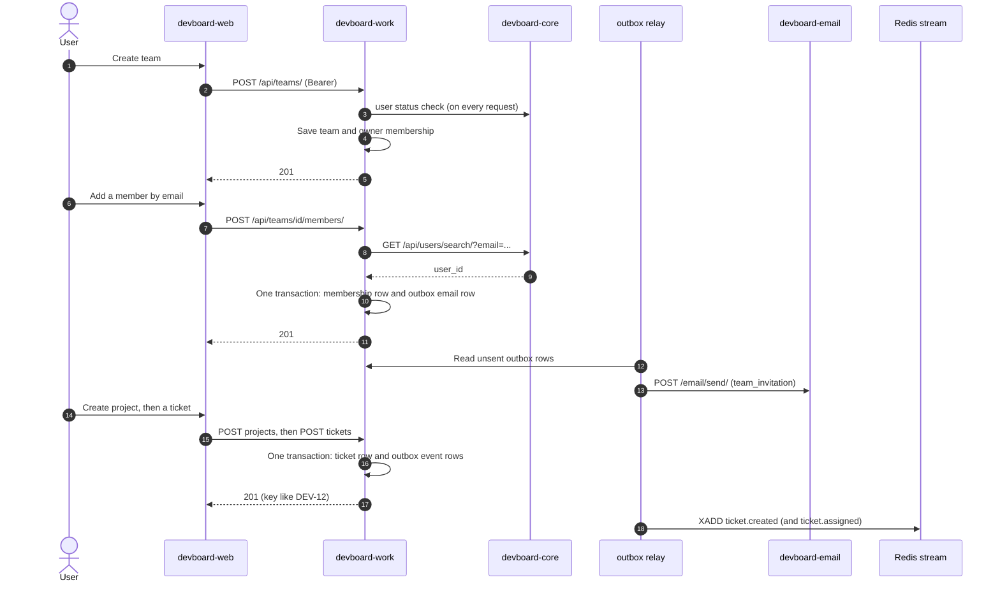

# Flow: team, project and ticket

> **In one minute:** A user creates a team, adds people, creates a project, then creates tickets and plans sprints.
> All of this happens in `devboard-work`. Work checks a role on every step. Some steps also send an event.

## The picture

## Step by step

Every request in this flow first passes the checks from [Login and refresh](login-and-refresh.md): a valid token, and an **active** user (work asks core).

1. **Create a team.** `POST /api/teams/`. Work saves the team, then the creator's membership with role `owner`. If the membership fails, work deletes the team again. No event is sent.
2. **Add a member.** `POST /api/teams/<id>/members/` with an email and a role.
   - The caller's role must be allowed to give that role.
   - Work asks core to find the user by email (`404` if unknown).
   - A person cannot be added twice (`409`).
   - Work saves the membership **and** an outbox row for the invitation mail in one transaction.
   - The relay sends the mail through email later. The person is a member **at once**. The mail only tells them.
3. **Create a project.** `POST /api/teams/<id>/projects/` with a name and a short key like `DEV`. The creator becomes the project `lead`. The key must be unique (`409`). If the membership fails, work deletes the project again.
4. **Add project members.** Team membership does **not** give access to a project. Each person is added to the project on its own, with role `lead` or `contributor`.
5. **Create a ticket.** `POST .../tickets/`. Work gives it the next number in the project, so the key is `DEV-1`, `DEV-2`, and so on. Rules:
   - Only a project lead can assign a ticket to someone else.
   - The assignee must be a project member.
   - Work saves the ticket and the events in one transaction: `ticket.created`, and `ticket.assigned` if there is an assignee.
6. **Change a ticket.** `PATCH .../tickets/<id>/`. Work sends **one event per changed field**:
   - `ticket.updated` for title, description, priority, type, due date and story points. It has the field, the old value and the new value.
   - `ticket.assigned`, `ticket.unassigned` and `ticket.status_changed`.
   - Epic links.
7. **Plan a sprint.** Create a sprint, add tickets, start it.
   - A project can have **one** active sprint.
   - A sprint needs **at least one ticket** to start.
   - A ticket is in **one** sprint at a time.
   - Starting sends `sprint.started`.
8. **Complete the sprint.** Only an active sprint. In **one transaction** work moves the unfinished tickets back to the backlog and saves the sprint as completed. It sends `sprint.completed`.
9. **Look at the work.** `GET .../board/` returns tickets grouped by status. `GET .../backlog/` returns tickets that are not in a sprint.

What happens to the events is in [Events and notifications](events-and-notifications.md).

## Who may do what

Work checks the **team role** first, then the **project role**.

| Level | Roles |
|---|---|
| Team | `owner`, `admin`, `member`, `viewer` |
| Project | `lead`, `contributor` |

## If a step fails

| Step | What happens |
|---|---|
| Any step, core is down | `503`. Work cannot check the user. |
| 2, core is down | `503`. The person is not added. |
| 2, email is down | The person **is** added. The mail row waits in the outbox and is retried up to 5 times. |
| 5 and 6, Redis is down | The ticket is saved. The events wait in the outbox. |
| 7, rule broken | `409` (already an active sprint, no tickets, ticket already in a sprint) |

## ⚠️ Known gaps

- **The outbox gives up after 5 attempts** (about 10 seconds). A longer Redis or email outage leaves rows stuck. See [devboard-work](../../services/work/index.md).
- **Assigning a ticket to yourself still gives you a notification.** Work does not skip the actor.
- **Creating a team, a project or a member puts nothing on the event stream.** (Adding a member only queues the invitation mail.) So analytics does not log those.

## Key code

| Where | What is there |
|---|---|
| [work `teams/services.py`](https://github.com/devboard-app/devboard-work/blob/0beba51/teams/services.py) | `create_team_with_owner`, `add_member` |
| [work `projects/services.py`](https://github.com/devboard-app/devboard-work/blob/0beba51/projects/services.py) | `create_project_with_lead`, `add_project_member` |
| [work `tickets/services.py`](https://github.com/devboard-app/devboard-work/blob/0beba51/tickets/services.py) | `create_ticket`, `update_ticket`, `get_board` |
| [work `sprints/services.py`](https://github.com/devboard-app/devboard-work/blob/0beba51/sprints/services.py) | `start_sprint`, `complete_sprint`, `add_ticket_to_sprint` |
| [work `outbox/writer.py`](https://github.com/devboard-app/devboard-work/blob/0beba51/outbox/writer.py) | `write_with_outbox` |

Next: [Comment and @mention](comment-and-mention.md).
