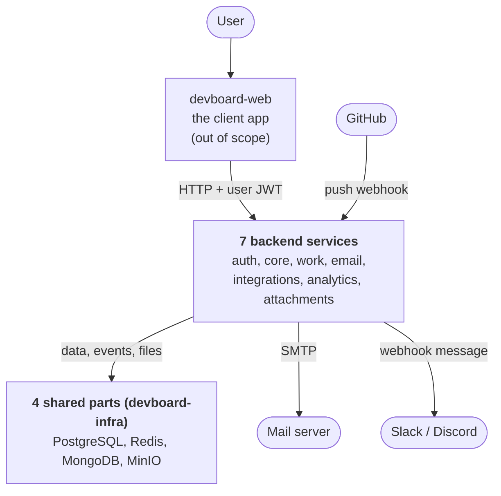
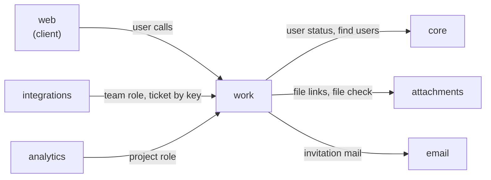
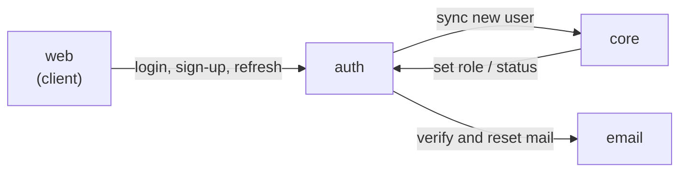
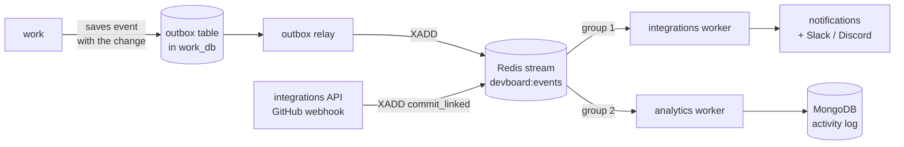

# System overview

> **In one minute:** DevBoard has 7 backend services and 4 shared infrastructure parts.
> Users log in at `devboard-auth` and get a token. Every other service checks that token.
> Services call each other over HTTP with a shared key. Events (like "ticket assigned") travel through one Redis stream.
>
> A word you do not know? See the [Glossary](glossary.md).

## The picture

Four small pictures instead of one big one. Each shows **one kind of connection**, so no lines cross.

### 1. The big picture

The one exception: for file uploads, the browser sends the file **straight to MinIO** with a temporary link. See [File upload](flows/file-upload.md).

### 2. Who calls whom: around work

Work is the hub. Three services ask it questions, and it asks three others.

### 3. Who calls whom: around auth

Auth has a small circle of its own.

### 4. Where events go

Events travel one way: from work, through Redis, to two readers.

How to read them:

- **Every arrow is labeled** with what is sent.
- **Workers** (`relay`, `integrations worker`, `analytics worker`) are extra containers built from the same repo as their service. They run background loops.
- **Which service uses which database** is in the table below, and in the [Data map](data-map.md).

## The services

| Repo | Port | Job | Stack | Stores data in |
|---|---|---|---|---|
| `devboard-auth` | 8001 | Sign-up, login, tokens, email check, password reset | FastAPI | PostgreSQL (`auth_db`), Redis (rate limits) |
| `devboard-email` | 8002 | Sends emails from HTML templates | FastAPI | nothing (uses SMTP) |
| `devboard-core` | 8003 | User profiles, roles, active or inactive status | Django + DRF | PostgreSQL (`core_db`) |
| `devboard-work` | 8004 | Teams, projects, tickets, sprints, labels, comments | Django + DRF | PostgreSQL (`work_db`) |
| `devboard-integrations` | 8005 | In-app notifications, Slack/Discord messages, GitHub commit links | Flask | PostgreSQL (`integrations_db`) |
| `devboard-analytics` | 8006 | Activity log, plus reports: activity, velocity, burndown, cycle time | FastAPI | MongoDB (`activity_db`) |
| `devboard-attachments` | 8007 | File upload lifecycle and file metadata | FastAPI | PostgreSQL (`attachments_db`), MinIO |
| `devboard-infra` | – | Runs Postgres, Redis, MongoDB, MinIO. Starts the whole stack | Docker Compose | – |

The four infra parts are `devboard-db` (one Postgres, five databases), `devboard-redis`, `devboard-mongo` and `devboard-minio`.

Redis has three jobs: the event stream, auth rate-limit counters, and web login sessions.

## How services talk

There are four ways:

1. **HTTP with a user token.** The client sends `Authorization: Bearer <JWT>`. Used for user requests.
2. **HTTP with a service key.** One service calls another with the header `X-Service-Key`. Used for internal calls.
3. **Redis stream `devboard:events`.** One-way messages. `devboard-work` and `devboard-integrations` write. `devboard-analytics` and `devboard-integrations` read. Each reader has its own consumer group, so both see every message.
4. **Presigned URLs.** `devboard-attachments` gives the client a temporary URL. The client uploads the file straight to MinIO.

`devboard-work` does not write to Redis in the request. It saves the event in an **outbox table**, in the same database transaction as the change. The relay container sends it later. An event is not lost if Redis is down.

## Auth in 30 seconds

**User requests:**

1. The user logs in at `devboard-auth`.
2. Auth returns an **access token** (JWT, 5 minutes) and a **refresh token** (random string, 7 days).
3. The client sends the access token to any service.
4. Each service checks the token itself with the shared `JWT_SECRET`. No call to auth is needed.
5. When the access token expires, the client swaps the refresh token for a new pair.

**Extra check:** the token alone is not enough. `devboard-core` checks that the user is still active in its own database. `devboard-work` asks `devboard-core` for the user status on every request.

**Who decides what a user may do:** `devboard-work` owns team roles and project roles. `devboard-integrations` and `devboard-analytics` have no role data. They ask `devboard-work` each time.

**Service-to-service:** all services share one `INTERNAL_API_KEY`. The caller sends it as `X-Service-Key`. The receiver compares it with its own copy.

More detail: [Auth and security](auth-and-security.md). The step-by-step walk is in [Login and refresh](flows/login-and-refresh.md).

## Honest notes

- ⚠️ `devboard-integrations` stores an `email_notifications` setting, but **nothing sends those emails yet**.
- ⚠️ **Do not run two copies of the same worker.** Today there is one integrations worker and one analytics worker. That is fine, because they have different names and different groups. But each worker has a fixed name in the code (`devboard-integrations-1`, `devboard-analytics-1`). If you started a second container of the **same** worker, both would use the same name. Redis could not tell them apart, they could take the same stuck message, and the retry count would be wrong. To scale up, give each container a unique name.
- ⚠️ Analytics reports rebuild ticket state from the event log **on every request**. Nothing is cached, so big projects will be slower.
- ⚠️ One shared `INTERNAL_API_KEY` means any service can call any internal endpoint.
- ⚠️ `devboard-work` asks `devboard-core` about the user on every request. If core is down, work requests fail.

## Where to run it

First run: open a terminal in `devboard-infra` and run `setup.bat`. It starts the infra, creates the databases, starts every service and runs the migrations.

Or use one command: `docker compose -f devboard-infra/stack.yml up -d --build`. It includes the compose file of every service. It does **not** run migrations.

## Where to go next

- One repo in detail: start with [devboard-work](../services/work/index.md), the biggest service.
- One journey end to end: [Team, project and ticket](flows/team-project-ticket.md) or [File upload](flows/file-upload.md).
- All flows: [Flows](flows/README.md).

Next: open [Team, project and ticket](flows/team-project-ticket.md) and match each arrow in its picture to an arrow in pictures 2 to 4 above.
