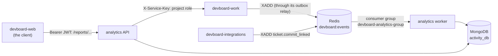

# devboard-analytics

> **In one minute:** Analytics answers "what happened, and how are we doing?"
> It reads every event from the Redis stream and saves it in MongoDB as an activity log. Then it builds reports from that log:
> activity, velocity, burndown and cycle time.

## At a glance

| | |
|---|---|
| Repo | [devboard-analytics](https://github.com/devboard-app/devboard-analytics) |
| Port | 8006 |
| Stack | FastAPI, Motor (async MongoDB driver), Redis Streams |
| Data | MongoDB `activity_db`: `events` (the log) and `failed_events` (events that could not be saved) |
| Containers | `devboard-analytics` (`uvicorn app.main:app`: the reports API) and `devboard-analytics-worker` (`python -m app.consumer.worker`: fills MongoDB) |
| Code layers | `routers` → `services` → `repositories`. The stream reader is in `app/consumer/` |

There are no migrations. Indexes are created when the service starts.

## Who talks to it

## How it checks callers

Report routes need a JWT. Analytics has no user data, so it asks **work** for the caller's project role on **every** report request (`GET /api/internal/projects/<project_id>/members/<user_id>/`).

| Route | Who may call |
|---|---|
| `GET /reports/projects/{id}/activity/` | Project members. Contributors see only their own activity. Leads see everyone's, and may filter with `actor=<user_id>`. |
| `GET /reports/projects/{id}/activity/summary/` | Project members. Same rule: who did what. |
| `GET /reports/projects/{id}/velocity/` | Project **leads** |
| `GET /reports/projects/{id}/cycle-time/` | Project **leads** |
| `GET /reports/sprints/{id}/burndown/` | Project **leads** (analytics finds the sprint's project first) |
| `POST /events/` | Other services, with `X-Service-Key`. Kept for backfill. Nothing calls it today. |

The JWT check reads only the signature. It does not ask core if the user is active.

## How events get saved

The worker loop (one message at a time):

1. Reclaim messages idle for 30 seconds. Read new ones (up to 10, wait up to 5 seconds).
2. If the event type is on the ignore list (`comment.mentioned`), ack and skip.
3. If the message was delivered more than 3 times, save it in `failed_events` and ack.
4. **Translate** the event into one clean `ActivityEvent`. A bad or unknown event goes to `failed_events` and is acked.
5. Set `_id` = the Redis message id. Set `created_at` = the time inside the Redis message id.
6. Insert into `events`. Ack.

Why this is safe:

- **Same event twice is fine.** The Redis id is the MongoDB `_id`. A second insert is ignored.
- **The log can be rebuilt.** A new consumer group reads the stream from the start. Drop the Mongo data, restart, and the log comes back from Redis.
- **Times stay true.** `created_at` comes from the message id, not from "now". A rebuild does not change history.

**Names are translated.** The saved name is not always the published name. Example: `ticket.status_changed` is saved as `ticket.updated` with `metadata.field = "status"`. Every field change has one shape, so reports are simpler. An **unknown event fails on purpose**, so new event types must be added by hand.

**Metadata is checked.** Each action has one fixed metadata shape, enforced when the event is saved. Reports can trust every row.

## How reports work

Reports rebuild the state of every ticket by **replaying the event log** in memory (`build_ticket_states`). Nothing is stored between requests.

| Report | Meaning |
|---|---|
| Activity feed | Newest events first. `limit` up to 100. |
| Who did what | Counts per person. |
| Velocity | Story points planned and finished, per sprint. Plus the average. |
| Cycle time | Median **lead time** (ticket created → done) and **cycle time** (time really worked on). |
| Burndown | Work left per day next to the ideal line. Needs the sprint's start and end dates, otherwise `409`. |

## If something is down

| Down | What happens |
|---|---|
| **work** | Every report route returns `503`, because the role check fails. |
| **MongoDB** | Reports fail. The worker keeps failing, and the messages stay pending. If it lasts long enough for a message to be delivered more than 3 times, that message goes to `failed_events` when MongoDB is back. The raw data is kept there. |
| **Redis** | The worker cannot read. Reports still work, but the log stops growing. |
| **The worker is stopped** | Events wait in the stream. They are saved when the worker starts again. |

## Known gaps

- ⚠️ **Reports are slow on big projects.** Each request replays the whole log for that project. Nothing is cached.
- ⚠️ **One worker only.** The consumer name is fixed (`devboard-analytics-1`). Two workers would break retries.
- ⚠️ **Duplicate events from work are not caught.** Work can send an event twice (see [devboard-work](../work/index.md)). The copy has a new Redis id, so it is saved twice.
- ⚠️ **`POST /events/` has no caller.** It is open to anyone with the service key. Delete it if backfill is not needed. Its key check uses `!=`, not a constant-time compare like auth does.
- ⚠️ **`get_recent_events` has no route.** The function exists but nothing calls it.

## Key code

These links open the code as it was at commit `637ba5e` (a saved snapshot in git). They keep working even if the code changes later.

| Where | What is there |
|---|---|
| [`app/consumer/worker.py`](https://github.com/devboard-app/devboard-analytics/blob/637ba5e/app/consumer/worker.py) | The loop: reclaim, read, retry count, dead-letter |
| [`app/consumer/translation.py`](https://github.com/devboard-app/devboard-analytics/blob/637ba5e/app/consumer/translation.py) | `translate_event`, `created_at_from_message_id` |
| [`app/repositories/events.py`](https://github.com/devboard-app/devboard-analytics/blob/637ba5e/app/repositories/events.py) | `insert_event` (ignores duplicates) |
| [`app/services/reports.py`](https://github.com/devboard-app/devboard-analytics/blob/637ba5e/app/services/reports.py) | `build_ticket_states`, `get_velocity`, `get_burndown`, `get_cycle_time`, `get_activity_feed`, `get_who_did_what` |
| [`app/routers/reports.py`](https://github.com/devboard-app/devboard-analytics/blob/637ba5e/app/routers/reports.py) | The 5 report routes and who may call each |
| [`app/dependencies.py`](https://github.com/devboard-app/devboard-analytics/blob/637ba5e/app/dependencies.py) | `get_current_user_id`, `get_project_role`, `require_project_lead` |
| [`app/schemas/events.py`](https://github.com/devboard-app/devboard-analytics/blob/637ba5e/app/schemas/events.py) | `ActivityEvent` and the metadata shapes |

Next: [devboard-infra](../infra/index.md), the parts everything runs on.
