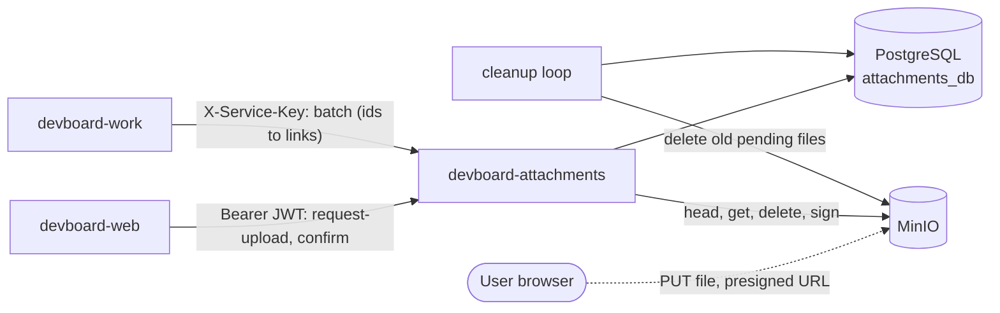

# devboard-attachments

> **In one minute:** Attachments handles file uploads. The client uploads the file **straight to MinIO** with a temporary link.
> Attachments only keeps the file info and checks that the file is real. It knows nothing about comments.

## At a glance

| | |
|---|---|
| Repo | [devboard-attachments](https://github.com/devboard-app/devboard-attachments) |
| Port | 8007 (MinIO: 9000 API, 9001 console) |
| Stack | FastAPI, async SQLAlchemy, Alembic, aioboto3 (S3 client), Pillow |
| Data | PostgreSQL `attachments_db` (one table: `attachments`). Files in MinIO |
| Containers | `devboard-attachments` (the API) and `devboard-attachments-cleanup` (a loop, every 15 minutes) |
| Code layers | `routers` → `services` → `repositories`. MinIO calls are in `app/storage.py` |

## Who talks to it

## How it checks callers

| Routes | Proof |
|---|---|
| `/attachments/*` | `Authorization: Bearer <jwt>`. The token's `sub` is the **owner**. Attachments checks only the signature. It does not ask core if the user is active. |
| `/internal/attachments/*` | `X-Service-Key` |

- **Before a file is attached**, only the owner can touch it. At upload time nothing else is known.
- **After it is attached**, the rules belong to whatever it is attached to (a comment). Only work knows those rules. So work decides who may see a comment, then asks attachments for links.

## How an upload works

The client's words in step 1 are only claims. Step 3 checks the real file.

1. `POST /attachments/request-upload/` (JWT). Checks: file type is allowed, declared size is under `MAX_FILE_SIZE_MB`, the context has fewer than `MAX_ATTACHMENTS_PER_CONTEXT` files. Saves a row with status `pending`. Returns `attachment_id` and `upload_url`.
2. The client sends `PUT` to `upload_url`. **This goes to MinIO. Attachments is not involved.**
3. `POST /attachments/{id}/confirm/` (JWT). Attachments reads the real object from MinIO and checks it:

| Check | Result if it fails |
|---|---|
| Object is missing | `409`, row removed |
| Real size is not the declared size | `409`, row removed |
| Real size is over the max | `413`, row and file removed |
| Content is not the declared type | `415`, row and file removed |

Content is checked, not the file name: images open with Pillow, PDFs start with `%PDF-`, text decodes as UTF-8. A zip file named `cat.png` fails. On success the status becomes `stored`. Calling confirm twice is safe.

**Reading files.** Work sends up to 100 ids to `POST /internal/attachments/batch/`. Attachments returns a fresh download link for each `stored` file. Links expire after `PRESIGNED_URL_TTL_SECONDS` (900 by default), so they are made on demand and never saved. Work also sends `owner_id` when it creates a comment. Then attachments returns only files owned by that user.

**Two S3 clients, on purpose.** A presigned link is tied to its host name. A link signed for `devboard-minio:9000` fails in the browser. So links are signed with the **public** address (`S3_PUBLIC_ENDPOINT_URL`). The service's own calls use the **internal** address (`S3_ENDPOINT_URL`).

## If something is down

| Down | What happens |
|---|---|
| **MinIO** | Links are still made, because signing needs no network call. But the upload, the confirm and the download all fail. |
| **PostgreSQL** | All routes fail. |
| **The client stops after step 1** | A `pending` row is left. The cleanup loop removes it later. |
| **attachments itself** (seen from work) | Comments still load, without files. Creating a comment with files fails with `503`. |

## Cleanup

The container `devboard-attachments-cleanup` runs `python -m app.cleanup` every 900 seconds (15 minutes). It deletes `pending` rows **older than 1 hour**, and their files.

## Known gaps

- ⚠️ **The `context_type` / `context_id` columns are never used to search.** Work keeps the file ids on the comment. The link is stored in work, not here.
- ⚠️ **The per-context limit can be skipped.** It counts only `stored` files, so many uploads requested before any confirm all pass.
- ⚠️ **The ownership check is optional.** `owner_id` on the batch route is not required. Work sends it when creating a comment, but not when reading.
- ⚠️ **No list route.** A lost attachment id cannot be found again.
- ⚠️ **Dev storage only.** MinIO uses root credentials, and there is no bucket policy. `reset-db.bat` now backs up the bucket before wiping it, so that part is no longer a gap — the shared credentials are.

## Key code

These links open the code as it was at commit `0921514` (a saved snapshot in git). They keep working even if the code changes later.

| Where | What is there |
|---|---|
| [`app/services/attachments.py`](https://github.com/devboard-app/devboard-attachments/blob/0921514/app/services/attachments.py) | `request_upload`, `confirm_upload`, `resolve_batch`, `resolve_url`, `delete_by_id` |
| [`app/storage.py`](https://github.com/devboard-app/devboard-attachments/blob/0921514/app/storage.py) | `init_storage`, `presign_put`, `presign_get`, `stat_object`, `download_object`, `delete_object` |
| [`app/cleanup.py`](https://github.com/devboard-app/devboard-attachments/blob/0921514/app/cleanup.py) | `cleanup_pending` |
| [`app/routers/attachments.py`](https://github.com/devboard-app/devboard-attachments/blob/0921514/app/routers/attachments.py) | User routes |
| [`app/routers/internal.py`](https://github.com/devboard-app/devboard-attachments/blob/0921514/app/routers/internal.py) | The batch route |
| [`app/models/attachment.py`](https://github.com/devboard-app/devboard-attachments/blob/0921514/app/models/attachment.py) | The `attachments` table and the `pending` / `stored` status |

Next: [devboard-integrations](../integrations/index.md), which turns events into notifications.
