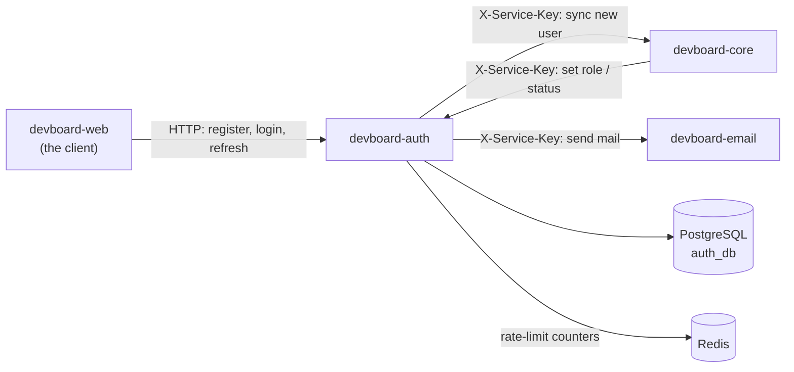

# devboard-auth

> **In one minute:** Auth answers "who are you?" It signs users up, logs them in and gives them tokens.
> Every other service trusts those tokens. Auth keeps users and tokens in its own PostgreSQL database.

## At a glance

| | |
|---|---|
| Repo | [devboard-auth](https://github.com/devboard-app/devboard-auth) |
| Port | 8001 |
| Stack | FastAPI, async SQLAlchemy, Alembic |
| Data | PostgreSQL `auth_db` (4 tables). Redis for rate-limit counters |
| Code layers | `routers` → `services` → `repositories`. Calls to other services live in `infrastructure` |

## Who talks to it

## How it checks callers

- **Public routes** (`/auth/...`) need no token. Rate limits protect them.
- **Internal routes** (`/internal/...`) need the header `X-Service-Key`. Auth compares it with `INTERNAL_API_KEY` using `hmac.compare_digest`.
- Auth **creates** access tokens. It never checks them. The other services check them.

## What it does

| Job | How it works |
|---|---|
| Sign up | Saves the user (role `member`), saves a verification token, tells core to create the profile, sends the "verify your email" mail. |
| Log in | Checks email and password. The user must be **active** and **verified**. Returns an access token and a refresh token. |
| Refresh | Swaps a refresh token for a new pair. The old refresh token is revoked. |
| Log out | Revokes one refresh token, or all tokens of that user (`logout-all`). |
| Verify email | The link from the mail. Token lives 1 day, works once. |
| Password reset | `forgot-password` sends a link. It always answers 200, so nobody can test which emails exist. `reset-password` sets the new password and logs the user out everywhere. Token lives 60 minutes. |
| Change role / status | Internal only. Called by core. Deactivating a user also revokes all their refresh tokens. |

**The tokens:**

| Token | Lives | What it is |
|---|---|---|
| Access token | 5 minutes | JWT, HS256, signed with `JWT_SECRET`. Holds user id (`sub`), email, role and expiry. |
| Refresh token | 7 days | Random string. Only its **SHA-256 hash** is stored. Each refresh gives a new one. |

**Rate limits** (counters in Redis):

| Route | Limit |
|---|---|
| Register | 10 per hour per IP |
| Login | 5 per 15 minutes per IP **and** per email |
| Resend verification, forgot password | 3 per hour per IP, 10 per hour per email |

A good login clears its counters.

## If something is down

| Down | What happens |
|---|---|
| **core**, during sign-up | `502`. The new user is deleted again (hard delete). |
| **email**, during sign-up | `502`, but the user is **already saved** and synced to core. The user can ask for a new mail with `resend-verification`. |
| **email**, during forgot-password | `502`. |
| **Redis** | The four rate-limited routes return `503`. Auth does not run them without limits. |
| **PostgreSQL** | Every route that needs the database fails. |

## Known gaps

- ⚠️ **Sign-up is not one step.** Auth saves the user first, then calls core. If auth stops between the two, auth has a user that core does not know.
- ⚠️ **A role change is not seen at once.** Core changes the role in auth, but tokens already issued keep the old role until they expire (up to 5 minutes).
- ⚠️ **A deactivated user can still use some services for up to 5 minutes.** Refresh tokens are revoked at once. But an existing access token is only checked for its signature by `integrations`, `analytics` and `attachments`. Only `core` and `work` check the user status live.

## Key code

These links open the code as it was at commit `b53e136` (a saved snapshot in git). They keep working even if the code changes later.

| Where | What is there |
|---|---|
| [`app/services/auth.py`](https://github.com/devboard-app/devboard-auth/blob/b53e136/app/services/auth.py) | All the flows: `register`, `login`, `refresh`, `logout_all`, `forgot_password`, `reset_password`, `update_user_status` |
| [`app/services/jwt.py`](https://github.com/devboard-app/devboard-auth/blob/b53e136/app/services/jwt.py) | `create_access_token`, `generate_refresh_token` |
| [`app/infrastructure/core.py`](https://github.com/devboard-app/devboard-auth/blob/b53e136/app/infrastructure/core.py) | `sync_user_to_core` |
| [`app/infrastructure/rate_limit.py`](https://github.com/devboard-app/devboard-auth/blob/b53e136/app/infrastructure/rate_limit.py) | `rate_limit` (a Redis counter with an expiry) |
| [`app/dependencies.py`](https://github.com/devboard-app/devboard-auth/blob/b53e136/app/dependencies.py) | `verify_internal_key` |
| [`app/exception_handlers.py`](https://github.com/devboard-app/devboard-auth/blob/b53e136/app/exception_handlers.py) | Which error becomes which HTTP status |

Next: [devboard-core](../core/index.md), the service that keeps the user profiles.
