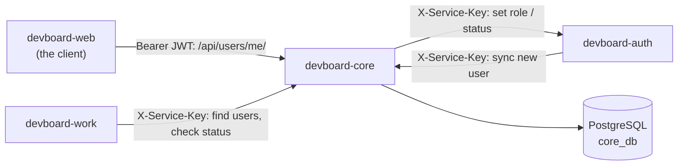

# devboard-core

> **In one minute:** Core keeps the user **profiles**: username, avatar, timezone, role and status.
> Auth owns the login. Core owns who the user is. Other services ask core about users.

## At a glance

| | |
|---|---|
| Repo | [devboard-core](https://github.com/devboard-app/devboard-core) |
| Port | 8003 |
| Stack | Django, Django REST Framework (async views) |
| Data | PostgreSQL `core_db`, one table: `user_profiles` |
| Code layers | `views` → `services` → `repository`. Calls to auth live in `infrastructure.py` |

## Who talks to it

## How it checks callers

| Caller | Proof | Can do |
|---|---|---|
| Normal user | `Authorization: Bearer <jwt>` | See and edit own profile. Look up other users (public info only). |
| Admin | Bearer token, and role `admin` in **core's** database | The above, plus list users, change status and role. |
| Another service | `X-Service-Key` | Sync users, search, look up, read status. |

For a Bearer token, core does three things:

1. Checks the JWT signature with `JWT_SECRET`.
2. Loads the profile from its own database. No profile, or status not `active`, means the request is refused.
3. Updates `last_active`, but only when the stored value is more than 5 minutes old — not a database write on every single request.

## What it does

| Job | Notes |
|---|---|
| Create a profile | Auth calls `POST /api/users/sync/` after sign-up. The **username is made by core** from the part of the email before `@`. If it is taken, core adds a number (`ana`, `ana2`, ...). |
| Show and edit a profile | Users can change only `avatar` and `timezone`. Email, username and role cannot be edited here. |
| Admin actions | List users. Set status (`active` / `inactive`). Set role (`admin` / `member`). |
| Answer other services | Find by email, look up usernames (max 25, used for `@mentions`), batch public info (max 100 ids), read a user's status. |

**A status or role change is a two-step call.** Core first tells auth (`PATCH /internal/users/<id>/status/` or `/role/`). Only when auth answers `204` does core save the change in its own table.

## If something is down

| Down | What happens |
|---|---|
| **auth**, on a status or role change | `502`. Nothing is saved. |
| **PostgreSQL** | Everything fails. Every service that asks core about a user also fails. |

## Known gaps

- ⚠️ **Role and status live in two places** (auth and core). They are changed by two separate calls, not one transaction. If core fails to save after auth said yes, the caller now gets a clear "could not save, please retry" error instead of a generic one — the sync to auth is safe to repeat, so retrying fixes it — but the two-call gap itself is unchanged.

## Key code

These links open the code as it was at commit `cb0c3e6` (a saved snapshot in git). They keep working even if the code changes later.

| Where | What is there |
|---|---|
| [`users/authentication.py`](https://github.com/devboard-app/devboard-core/blob/cb0c3e6/users/authentication.py) | `JWTAuthentication`: check token, load profile, block inactive users, set `last_active` |
| [`users/services.py`](https://github.com/devboard-app/devboard-core/blob/cb0c3e6/users/services.py) | `sync_user`, `update_user_status`, `update_user_role` |
| [`users/infrastructure.py`](https://github.com/devboard-app/devboard-core/blob/cb0c3e6/users/infrastructure.py) | `sync_user_status_to_auth`, `sync_user_role_to_auth` |
| [`users/models.py`](https://github.com/devboard-app/devboard-core/blob/cb0c3e6/users/models.py) | `UserProfile`. Its `save()` makes the username |
| [`users/permissions.py`](https://github.com/devboard-app/devboard-core/blob/cb0c3e6/users/permissions.py) | Admin check and service-key check |
| [`users/urls.py`](https://github.com/devboard-app/devboard-core/blob/cb0c3e6/users/urls.py) | All routes in one file |

Next: [devboard-email](../email/index.md), the smallest service.
