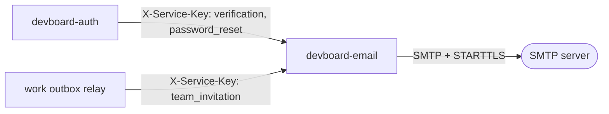

# devboard-email

> **In one minute:** Email is the mail sender. Another service sends it a template name and some values.
> Email builds the HTML mail and sends it over SMTP. It has no database and it is never public.

## At a glance

| | |
|---|---|
| Repo | [devboard-email](https://github.com/devboard-app/devboard-email) |
| Port | 8002 |
| Stack | FastAPI, aiosmtplib, Jinja2 |
| Data | None. Nothing is stored |
| Code layers | `routers` → `services`. Templates are in `app/templates/` |

## Who talks to it



| Caller | When | Template |
|---|---|---|
| `devboard-auth` | A user signs up, or asks for a new verify mail | `verification` |
| `devboard-auth` | A user forgets the password | `password_reset` |
| `devboard-work` (outbox relay) | Someone is added to a team | `team_invitation` |

## How it checks callers

Every route except `/health` needs `X-Service-Key: <INTERNAL_API_KEY>`. A wrong or missing key gives `403`.

There are no user tokens here. Users never call this service.

## What it does

One route does the work: `POST /email/send/`.

```json
{ "to": "user@example.com", "subject": "Hi", "template": "verification", "variables": { "verification_link": "..." } }
```

1. Load `app/templates/<template>.html` with Jinja2. Add `app_url` from `APP_URL`.
2. Build an HTML message with `MAIL_FROM` as the sender.
3. Send it over SMTP with STARTTLS.

| Template | Variables you must send |
|---|---|
| `verification` | `verification_link` |
| `password_reset` | `reset_link` |
| `team_invitation` | `team_name`, `inviter_name` |

`base.html` is the shared layout. To add a template, add a new `<name>.html` file. Nothing else changes.

## If something is down

| Problem | What the caller gets |
|---|---|
| SMTP server fails | `502` "Failed to deliver email" |
| SMTP refuses the recipient | `400` "Recipient refused the email" |
| Template name does not exist | `400` "Template not found" |
| Wrong service key | `403` |

Email has **no queue and no retry**. The caller decides what to do:

- **auth** turns the error into its own `502`.
- **work** retries the invitation up to 5 times (see [devboard-work](../work/index.md), "Events and the outbox").

## Known gaps

- ⚠️ **No retry inside email.** If SMTP is down, the mail is lost unless the caller retries. Only work does.
- ⚠️ **`APP_URL` is required but missing from `.env.example`.** You must add it yourself.
- ⚠️ **No notification mails yet.** Nothing calls email for ticket or comment events. `devboard-integrations` stores an `email_notifications` setting, but nothing uses it.

## Key code

These links open the code as it was at commit `13f748d` (a saved snapshot in git). They keep working even if the code changes later.

| Where | What is there |
|---|---|
| [`app/routers/email.py`](https://github.com/devboard-app/devboard-email/blob/13f748d/app/routers/email.py) | The `POST /email/send/` route |
| [`app/services/email.py`](https://github.com/devboard-app/devboard-email/blob/13f748d/app/services/email.py) | `render_template`, `build_message`, `send_email` |
| [`app/dependencies.py`](https://github.com/devboard-app/devboard-email/blob/13f748d/app/dependencies.py) | The service-key check |
| [`app/exception_handlers.py`](https://github.com/devboard-app/devboard-email/blob/13f748d/app/exception_handlers.py) | Which error becomes which HTTP status |

Next: [devboard-work](../work/index.md), the biggest service.
