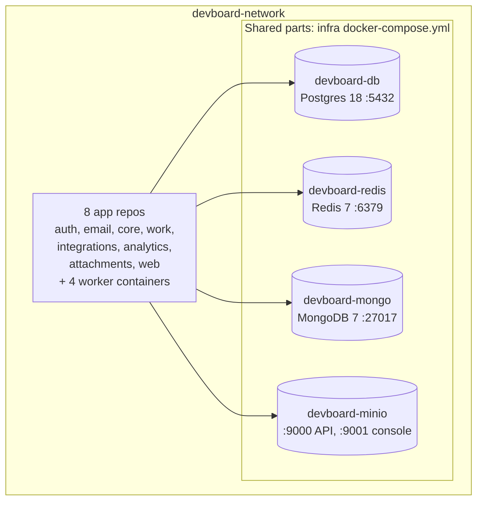

# devboard-infra

> **In one minute:** Infra is the control room. It runs the shared parts (PostgreSQL, Redis, MongoDB, MinIO)
> and has the scripts that start, stop, update and reset the whole stack. It has no app code.

## At a glance

| | |
|---|---|
| Repo | [devboard-infra](https://github.com/devboard-app/devboard-infra) |
| Stack | Docker Compose, Windows `.bat` scripts, one shell script for the database setup |
| Data | Four Docker volumes: `devboard_pgdata`, `devboard_mongodata`, `devboard_miniodata`, `devboard_redisdata` |
| Network | One Docker network for everything: `devboard-network` (created once by hand) |

## What runs here

The 4 worker containers are: `devboard-work-outbox-relay`, `devboard-integrations-worker`, `devboard-analytics-worker` and `devboard-attachments-cleanup`.

| Container | What it holds | Notes |
|---|---|---|
| `devboard-db` | **One** Postgres, **five** databases: `auth_db`, `core_db`, `work_db`, `integrations_db`, `attachments_db` | Each has its own user (`auth_user`, `core_user`, ...), and the database is owned by that user. The script does not grant any cross-database access. |
| `devboard-redis` | The event stream `devboard:events`, auth rate-limit counters, web login sessions | Started with `--appendonly yes`. Without it, a restart would lose the stream and the consumer offsets. |
| `devboard-mongo` | `activity_db` (analytics) | The `analytics_user` is made by `setup.bat`. |
| `devboard-minio` | Uploaded files | The bucket is created by attachments at start. |

## Two ways to start

| Way | Command | Use it for |
|---|---|---|
| **Scripts** | `setup.bat` in `devboard-infra` | First run. It starts infra, creates users and databases, builds every service, runs migrations. |
| **One command** | `docker compose -f devboard-infra/stack.yml up -d --build` (from the folder that holds all repos) | Start and stop everything together. |

`stack.yml` uses `include:` to pull in the compose file of every repo. Every repo can still start alone (`docker compose up` in its folder).

| Script | What it does |
|---|---|
| `setup.bat` | First run, or after a reset. |
| `redeploy.bat` | Menu. Rebuild one service (`1` to `8`) or all (`0`). Does **not** run migrations. |
| `migrate.bat` | Menu. Run migrations for auth, core, work, integrations or attachments. |
| `stop.bat` | Saves a Postgres backup to `backups/devboard_all.sql`, then stops everything. Data stays in the volumes. |
| `reset-db.bat` | **Deletes all data** and rebuilds. Backs up Postgres and MongoDB first. You must type `DESTROY`. |

## How the databases are made

`init-db/01-init.sh` creates one role and one database per service. It reads `AUTH_DB_PASSWORD`, `CORE_DB_PASSWORD`, `WORK_DB_PASSWORD`, `INTEGRATIONS_DB_PASSWORD` and `ATTACHMENTS_DB_PASSWORD`.

It runs **only when the Postgres volume is empty**. Each password must match the one in that service's own `.env`. A mismatch is the most common reason a migration fails.

## If something is down

| Down | What happens |
|---|---|
| **PostgreSQL** | auth, core, work, integrations and attachments fail. Since work needs core for every request, the API is down. |
| **Redis** | Auth rate-limited routes return `503`. Work keeps running, and its events wait in the outbox. Readers stop. Web sessions are lost on a `reset-db`. |
| **MongoDB** | Analytics reports and the worker fail. Nothing else is affected. |
| **MinIO** | Uploads and downloads fail. Nothing else is affected. |
| **At start** | Everything starts at once. App containers restart a few times until Postgres is healthy. That is normal. `stack.yml` does not order the start. |

## Known gaps

- ⚠️ **One Postgres for five services.** It is one point of failure. Each service has its own database and user, but they share the server.
- ⚠️ **MinIO is not backed up.** `reset-db.bat` deletes every uploaded file.
- ⚠️ **No start order (minor).** `stack.yml` has no `depends_on`, because that would break running a repo alone. The containers use `restart: unless-stopped`, so they restart until Postgres is ready. The only cost is noisy logs at start.
- ⚠️ **Dev settings.** Database, Redis, MongoDB and MinIO ports are open on the host. MinIO uses root credentials.
- ⚠️ **Windows only.** The scripts are `.bat` files.
- ⚠️ **`stack.yml` does not run migrations.** Run `migrate.bat` after it.

## Key files

These links open the code as it was at commit `d6bac21` (a saved snapshot in git). They keep working even if the code changes later.

| Where | What is there |
|---|---|
| [`docker-compose.yml`](https://github.com/devboard-app/devboard-infra/blob/d6bac21/docker-compose.yml) | The four shared containers, volumes and health checks |
| [`stack.yml`](https://github.com/devboard-app/devboard-infra/blob/d6bac21/stack.yml) | The one-command entry point |
| [`init-db/01-init.sh`](https://github.com/devboard-app/devboard-infra/blob/d6bac21/init-db/01-init.sh) | Creates the roles and databases |
| [`setup.bat`](https://github.com/devboard-app/devboard-infra/blob/d6bac21/setup.bat) | The first-run script |
| [`reset-db.bat`](https://github.com/devboard-app/devboard-infra/blob/d6bac21/reset-db.bat) | The reset script and its backups |

Next: go back to the [system overview](../../architecture/overview.md) and follow one arrow from the diagram into a service page.
