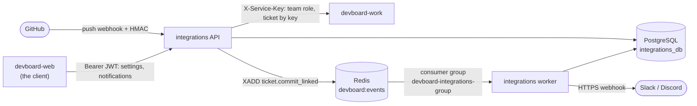

# devboard-integrations

> **In one minute:** Integrations tells people what happened. It turns events into in-app notifications and Slack or Discord messages.
> It also receives GitHub push webhooks and links commits to tickets.

## At a glance

| | |
|---|---|
| Repo | [devboard-integrations](https://github.com/devboard-app/devboard-integrations) |
| Port | 8005 |
| Stack | Flask, SQLAlchemy, Alembic, gunicorn |
| Data | PostgreSQL `integrations_db`: `team_integrations`, `repo_links`, `linked_commits`, `notifications`, `failed_events` |
| Containers | `devboard-integrations` (`gunicorn wsgi:app`: REST API and webhook) and `devboard-integrations-worker` (`python -m app.consumer.worker`: reads the stream) |
| Code layers | Folders by area: `integrations/`, `notifications/`, `webhooks/`, `consumer/`. Each has `views` → `services` → `repository` |

There are no user or team tables here. Integrations asks work who is on a team.

## Who talks to it



## How it checks callers

| Route | Proof |
|---|---|
| `/api/integrations/<team_id>/...` | JWT **and** `owner` or `admin` on that team. Integrations asks work each time: `GET /api/internal/teams/<team_id>/members/<user_id>/` |
| `/api/notifications/...` | JWT only. Each row is checked against the caller. |
| `/api/webhooks/github/` | No JWT. GitHub proves itself with `X-Hub-Signature-256` (HMAC with `GITHUB_WEBHOOK_SECRET`), checked with `hmac.compare_digest`. |

The JWT check reads only the token signature. It does not ask core if the user is active.

## What it does

**1. Team settings.** Each team saves a Slack webhook URL, a Discord webhook URL and linked GitHub repos. `enabled_triggers` says which event goes to which provider:

```json
{ "slack": { "sprint.started": true }, "discord": { "sprint.completed": true } }
```

A message is sent **only if** the URL is set **and** the trigger is `true`. URLs are checked on save: `https` only. Slack host must be `hooks.slack.com`. Discord host must be `discord.com` or `discordapp.com`. This stops an admin from pointing a webhook at an internal service.

**2. The event consumer.** The worker reads the stream `devboard:events` as group `devboard-integrations-group`. Analytics reads the same stream with its own group, so both see every message.

| Event | Result |
|---|---|
| `ticket.assigned`, `ticket.status_changed`, `comment.created`, `comment.mentioned` | In-app notification for the `recipient_id` |
| `sprint.started`, `sprint.completed` | Slack and Discord message |
| Anything else | Acked and dropped, on purpose (analytics handles those) |

Each loop: reclaim messages idle for 60 seconds, then read new ones (up to 10, wait up to 5 seconds). If a handler raises, the message is **not** acked. It comes back on the next reclaim. After **3 tries** it goes to `failed_events` and is acked.

**3. GitHub commit links.** On `push`:

1. Check the signature. Ignore anything that is not `push`.
2. Find the repo in `repo_links`. Unknown repo: ignore.
3. Find ticket keys in each commit message (pattern like `DEV-12`).
4. Ask work if the ticket exists in that project.
5. Insert `(repo, commit_sha, ticket_id)` into `linked_commits`. A duplicate is skipped. This stops GitHub redeliveries.
6. Publish `ticket.commit_linked` to the stream. The actor is a **fixed system id**, not the commit author. Anyone can fake a commit author.

## If something is down

| Down | What happens |
|---|---|
| **work** | Settings routes return `503`. Ticket lookups return "not found", so those commit links are skipped. |
| **Redis** | The worker cannot read. Events wait in the stream. Publishing `commit_linked` fails (see gaps). |
| **PostgreSQL** | Handlers fail and are not acked. Messages stay pending and are retried. The dead-letter table is in the same database, so it is not available either. |
| **Slack or Discord** | The error is logged. The message is **not** retried. |

## Known gaps

- ⚠️ **Email notifications are not built.** `email_notifications` is stored, but nothing reads it. `EMAIL_SERVICE_URL` and `CORE_SERVICE_URL` are required but unused. Core also has no route that returns a user's email from a user id. So the worker could not look up the address yet.
- ⚠️ **A failed publish loses the commit link.** The row in `linked_commits` is saved before the publish. If the publish fails, a GitHub redelivery is skipped as a duplicate.
- ⚠️ **One worker only.** The consumer name is fixed (`devboard-integrations-1`). Two workers would break retry counting.
- ⚠️ **A typo in an event name fails silently.** Unknown events are acked and dropped.
- ⚠️ **One repo, one project.** `repo_links.github_repo` is unique across all teams.
- ⚠️ **Slack and Discord messages are fire and forget.** No retry.

## Key code

These links open the code as it was at commit `694a98f` (a saved snapshot in git). They keep working even if the code changes later.

| Where | What is there |
|---|---|
| [`app/consumer/worker.py`](https://github.com/devboard-app/devboard-integrations/blob/694a98f/app/consumer/worker.py) | The read loop: reclaim, read, dispatch, retry count |
| [`app/consumer/handlers.py`](https://github.com/devboard-app/devboard-integrations/blob/694a98f/app/consumer/handlers.py) | `HANDLERS`: which event runs which function |
| [`app/consumer/dead_letter.py`](https://github.com/devboard-app/devboard-integrations/blob/694a98f/app/consumer/dead_letter.py) | Writes to `failed_events` |
| [`app/webhooks/views.py`](https://github.com/devboard-app/devboard-integrations/blob/694a98f/app/webhooks/views.py) | The GitHub route and the signature check |
| [`app/webhooks/services.py`](https://github.com/devboard-app/devboard-integrations/blob/694a98f/app/webhooks/services.py) | `handle_github_push`, `extract_ticket_keys`, `lookup_ticket`, `publish_commit_linked`, Slack and Discord senders |
| [`app/auth.py`](https://github.com/devboard-app/devboard-integrations/blob/694a98f/app/auth.py) | `jwt_required`, `require_team_admin` |
| [`app/work_client.py`](https://github.com/devboard-app/devboard-integrations/blob/694a98f/app/work_client.py) | `get_internal`: the call to work |
| [`app/integrations/services.py`](https://github.com/devboard-app/devboard-integrations/blob/694a98f/app/integrations/services.py) | `_validate_webhook_url` |

Next: [devboard-analytics](../analytics/index.md), the other reader of the event stream.
