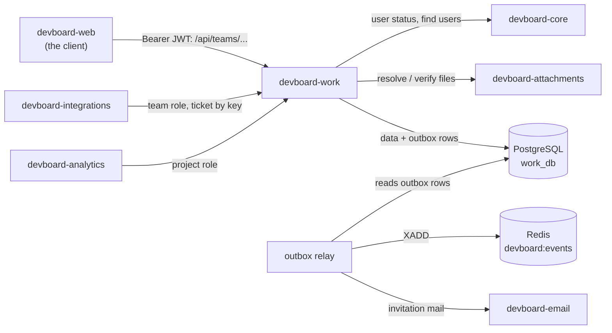

# devboard-work

> **In one minute:** Work is the heart of DevBoard. Teams, projects, tickets, sprints, labels and comments all live here.
> It also decides who may do what (team roles and project roles). Every change sends an event to the rest of the system.

## At a glance

| | |
|---|---|
| Repo | [devboard-work](https://github.com/devboard-app/devboard-work) |
| Port | 8004 |
| Stack | Django, Django REST Framework (async views), Redis client |
| Data | PostgreSQL `work_db`: `teams`, `memberships`, `projects`, `project_memberships`, `tickets`, `sprints`, `labels`, `comments`, `outbox_events` |
| Containers | `devboard-work` (the API) and `devboard-work-outbox-relay` (sends events) |
| Code layers | One Django app per area (`teams`, `projects`, `tickets`, `sprints`, `labels`, `comments`, `outbox`). Each has `views` → `services` → `repository`. Outside calls live in `infrastructure.py` |

## Who talks to it

## How it checks callers

**User requests** (`Authorization: Bearer <jwt>`):

1. Check the JWT signature with `JWT_SECRET`.
2. Ask **core** for the user status (`/api/users/internal/<id>/status/`). Only `active` passes. The result is cached in Redis for 60 seconds, so this isn't a call to core on every single request — a deactivated user is blocked within 60 seconds instead of immediately.
3. Check the **team role**, then the **project role**.

| Level | Roles |
|---|---|
| Team | `owner`, `admin`, `member`, `viewer` |
| Project | `lead`, `contributor` |

Being on a team does **not** give access to its projects. Project membership is separate.

**Other services** call `/api/internal/...` with `X-Service-Key`. There are 4 internal routes. They answer: is this user on this team (and with what role)? Does this project belong to this team? What is this user's project role? Which ticket has this key (like `DEV-12`)?

## What it does

| Area | What lives here | Rules worth knowing |
|---|---|---|
| Teams | Team, members (added by **email**), roles | Adding a member sends an invitation mail. |
| Projects | Belong to a team. Have a short key like `DEV`. Members and project roles | Also serve the `board` (tickets by status) and `backlog` (tickets not in a sprint). |
| Tickets | Keys like `DEV-12`. Types: `epic`, `bug`, `feature`, `task`, `improvement`. Statuses: `backlog`, `todo`, `in_progress`, `in_review`, `done` | Can link to a parent epic. |
| Sprints | Time boxes | One active sprint per project. A sprint needs at least one ticket to start. A ticket is in one sprint at a time. Only an active sprint can be completed. |
| Labels | Tags on tickets | Apply and remove per ticket. |
| Comments | Text on a ticket | Files and `@mentions`, see below. |

**Comment files.** A comment stores only file ids. When it is read, work asks attachments for download links (one call for the whole page). When a comment is **created**, work asks attachments to check that the caller owns every id. When a comment is **deleted**, its file ids go out with the `comment.deleted` event, so attachments can delete the files too instead of leaving them orphaned.

**Comment mentions.** `@username` in a comment is looked up in core and saved as user ids. Unknown names, self-mentions and users outside the project are dropped without an error. Editing a comment rebuilds the list. Only **new** mentions send a notification. Editing cannot change the files.

## Events and the outbox

Work never writes to Redis inside a request. It uses an **outbox**:

1. The change and its event are saved in **one database transaction** (`write_with_outbox`). The event is a row in `outbox_events`.
2. The relay container runs `python manage.py drain_outbox`. Every 2 seconds it reads unsent rows, oldest first, Redis rows before email rows.
3. It sends each row: to the Redis stream `devboard:events`, or to devboard-email.
4. On success it sets `delivered_at`. On failure it retries with a growing delay (4s, doubling up to a 300s cap) instead of failing fast. After **150 attempts** — roughly half a day — the row is left as failed and needs a manual retry.
5. Every Redis event carries the outbox row's own id (`outbox_id`), so if the relay crashes after sending but before marking a row delivered, the redelivery can be told apart from a genuinely new event by whoever reads it (analytics dedupes on this).

Event groups on the stream:

- `ticket.*`: created, updated, assigned, unassigned, status_changed, deleted, epic and sprint links.
- `label.applied` and `label.removed`.
- `sprint.started` and `sprint.completed`.
- `comment.*`: created, updated, deleted, mentioned.

An event that needs a notification carries a `recipient_id`.

## If something is down

| Down | What happens |
|---|---|
| **core** | Requests within 60 seconds of the last successful check still pass (cached). After that, requests fail with `503` (the status check). Adding a member by email also fails. |
| **Redis** | Requests keep working. Events wait in the outbox and retry with backoff for up to ~150 attempts before being left as failed. |
| **email** | The team member is still added. The invitation row is retried like any other. |
| **attachments**, reading comments | Comments load with an empty `attachments` list. |
| **attachments**, creating a comment with files | `503` after 3 tries (about 5 seconds max). |
| **core**, during a mention lookup | The comment is saved. Mentions are skipped. |
| **PostgreSQL** | Everything fails. |

## Key code

These links open the code as it was at commit `0beba51` (a saved snapshot in git). They keep working even if the code changes later.

| Where | What is there |
|---|---|
| [`work/authentication.py`](https://github.com/devboard-app/devboard-work/blob/0beba51/work/authentication.py) | `JWTAuthentication`: check token, then ask core for status |
| [`teams/infrastructure.py`](https://github.com/devboard-app/devboard-work/blob/0beba51/teams/infrastructure.py) | `get_user_status`, `get_user_id_by_email` (calls to core) |
| [`outbox/writer.py`](https://github.com/devboard-app/devboard-work/blob/0beba51/outbox/writer.py) | `write_with_outbox`, `awrite_with_outbox` |
| [`outbox/management/commands/drain_outbox.py`](https://github.com/devboard-app/devboard-work/blob/0beba51/outbox/management/commands/drain_outbox.py) | The relay loop |
| [`outbox/dispatch.py`](https://github.com/devboard-app/devboard-work/blob/0beba51/outbox/dispatch.py) | `dispatch`: Redis `XADD` or HTTP to email |
| [`work/infrastructure/events.py`](https://github.com/devboard-app/devboard-work/blob/0beba51/work/infrastructure/events.py) | `build_payload` (the event format) |
| [`comments/services.py`](https://github.com/devboard-app/devboard-work/blob/0beba51/comments/services.py) | `create_comment`, `update_comment`, `delete_comment` |
| [`comments/infrastructure.py`](https://github.com/devboard-app/devboard-work/blob/0beba51/comments/infrastructure.py) | `resolve_attachments`, `verify_attachments`, `resolve_usernames` (with retries) |
| [`work/urls.py`](https://github.com/devboard-app/devboard-work/blob/0beba51/work/urls.py) | All routes, including the 4 internal ones |

Next: [devboard-attachments](../attachments/index.md), where the comment files live.
